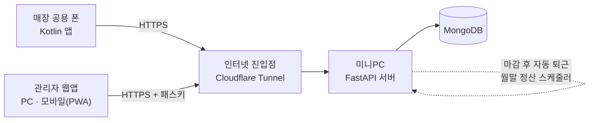
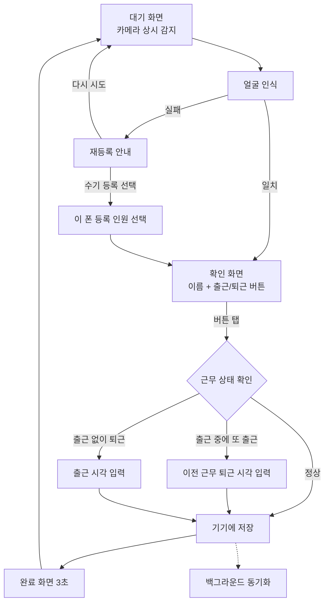
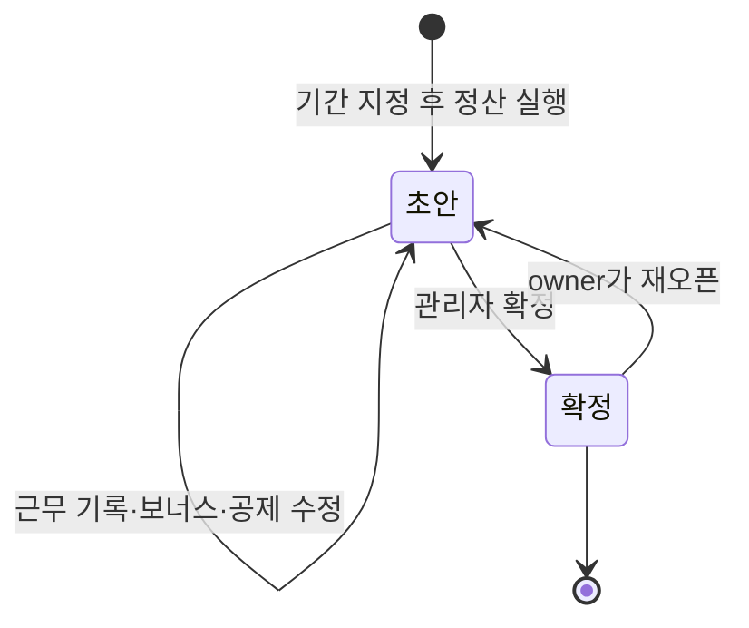
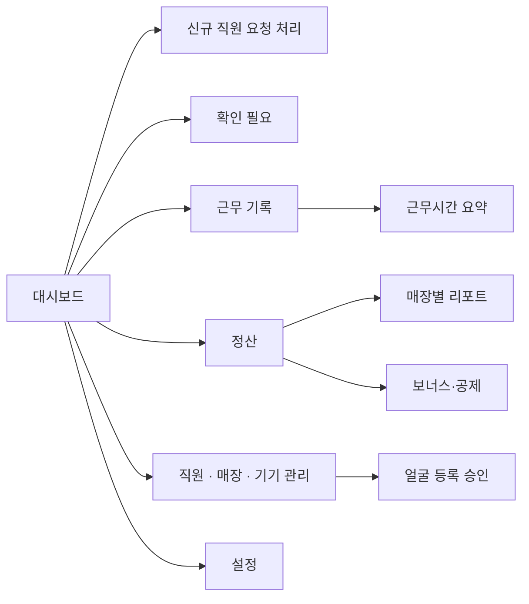

# 식당 직원 출퇴근·급여 관리 시스템 설계서

2026-09-19 · @Someone

## 개요와 확정된 요구사항

3개 매장의 직원과 알바생 출퇴근을 매장 공용 안드로이드 폰에서 얼굴 인식으로 기록하고, 미니PC 서버에서 근무시간과 급여를 집계하는 시스템입니다. 지금까지 합의한 결정은 아래와 같습니다.

| 항목 | 결정 |
| --- | --- |
| 매장 | 3개 매장, 매장마다 공용 폰 1대 |
| 얼굴 인식 | 앱에서 직접 구현, 완전 온디바이스. 서버에는 얼굴 데이터를 보내지 않음 |
| 라이브니스 검증 | 하지 않음 (직원이 상주하고, 사후에 이상 기록을 확인) |
| 얼굴 등록 | 폰이 서버에서 직원 목록을 받아 본인 이름을 선택해 셀프 등록. 이름이 목록에 없는 신규 직원은 폰에서 이름을 적어 임시 저장하고 관리자에게 요청하며, 관리자는 대시보드에서 바로 수락. 승인 전에도 그 폰에서 출퇴근 가능 |
| 얼굴 백업 | 하지 않음. 폰 교체나 앱 초기화 시 재등록 |
| 얼굴 인식 실패 | 재등록을 안내함. 선택 옵션으로 이 폰에 등록된 인원 중에서 누가 출퇴근했는지 수기로 등록할 수 있고, 서버에 특이사항으로 기록 |
| 출퇴근 기록 | 얼굴 인식 후 화면 하단의 출근/퇴근 버튼으로 확정 |
| 출퇴근 특이사항 | 세 가지. (1) 퇴근 없이 출근: 이전 근무의 퇴근 시각을 수기 입력. (2) 출근 없이 퇴근: 출근 시각을 수기 입력. (3) 퇴근 안 찍음: 매장 영업 마감시각으로 자동 퇴근. 모두 서버에 특이사항으로 기록되고 관리자가 나중에 수정 |
| 휴게시간 | 별도 관리하지 않음. 알바는 휴게 때 퇴근을 찍고 다시 출근을 찍고, 직원은 포괄임금 |
| 오프라인 | 기기에 먼저 저장하고 연결되면 서버로 동기화 |
| 서버 | 미니PC의 Python(FastAPI)과 기존 MongoDB |
| 관리자 도구 | 웹앱(PWA) 하나로 PC와 모바일 모두 지원, 외부 인터넷 접속 가능 |
| 프론트엔드 | 어느 쪽이든 무방하다고 하셔서 Vue 3로 진행 |
| 근로자 구분 | 알바(시급제)와 직원(월급제) |
| 알바 급여 | 시급제. 기본은 최저시급이고 개인별 시급 설정 가능. 주휴수당, 야간·휴일 가산, 4대보험은 인원별로 관리자가 설정. 시급을 바꿀 때 이번 달부터와 다음 달부터 중 선택 |
| 직원 급여 | 월급제(포괄임금). 월급을 저장하고 시급 계산은 하지 않음 |
| 보너스와 공제 | 명절 수당 같은 추가 지급(보너스)과 결근 공제를 각각 금액과 목적을 함께 기록 |
| 정산 기간 | 기본은 1일부터 말일이며, 정산할 때 기간을 직접 지정할 수도 있음 |
| 여러 매장 근무 | 급여는 한 매장(급여 관리 매장)에서만 관리하고, 출퇴근한 매장은 기록으로 남김. 직원 이동 기능을 제공하며, 이동은 다음 달부터 적용 |
| 관리자 조회·수정 | 매장별, 직원별로 어느 매장에서 몇 시간 일했는지 조회하고 수정. 월말에 개인별, 매장별 급여 조회 |

이 문서에서 "제안"이라고 표시한 항목은 아직 확정되지 않은 것이며, 마지막 절의 미결정 사항에 모아 두었습니다.

## 시스템 구조

시스템은 네 부분으로 나뉩니다. 매장 폰 앱, 미니PC의 API 서버, MongoDB, 관리자 웹앱이며, 얼굴 데이터는 매장 폰 밖으로 나가지 않습니다.



앱과 관리자 웹앱은 모두 같은 서버 API를 사용하고, 서버는 인터넷에 포트를 직접 열지 않고 터널을 통해서만 노출합니다.

### 기술 스택

| 구성 요소 | 선택 | 이유 |
| --- | --- | --- |
| 안드로이드 앱 | Kotlin, Jetpack Compose, CameraX | 카메라와 온디바이스 ML을 가장 직접 쓸 수 있음 |
| 얼굴 검출 | ML Kit Face Detection | 온디바이스 동작, 얼굴 위치와 각도 제공 |
| 얼굴 임베딩 | TensorFlow Lite 모델(MobileFaceNet 계열) | 얼굴을 128\~512차원 벡터로 변환해 직원별로 비교 |
| 앱 로컬 저장 | Room(SQLite), 얼굴 벡터는 Android Keystore 키로 암호화 | 오프라인 대기열과 얼굴 데이터를 안전하게 보관 |
| 서버 | Python FastAPI, Motor(MongoDB 비동기 드라이버) | 기존 MongoDB를 그대로 사용, 비동기로 가볍게 운영 |
| 스케줄러 | APScheduler(서버 프로세스 안) | 자동 퇴근과 월말 정산 작업 |
| 관리자 웹앱 | Vue 3(Vite) 기반 PWA | 한 코드로 PC와 폰 홈 화면 설치를 모두 지원 |
| 외부 접속 | Cloudflare Tunnel | 공유기 포트 개방 없이 HTTPS 노출 |
| 매장 폰과 서버 사이 | 같은 API와 같은 터널 | VPN 설치 없이 앱 하나로 동작 |

고정 IP를 쓸 수 없어 외부 접속은 Cloudflare Tunnel로 확정했습니다. 공유기 포트를 열지 않고 HTTPS로 노출할 수 있고, 매장 폰도 별도 VPN 앱 없이 같은 주소로 서버에 접속합니다.

## 데이터 모델 (MongoDB)

핵심은 두 가지입니다. 변경되지 않는 원본 기록(attendance\_events)과 관리자가 수정하는 근무 기록(shifts)을 분리했고, 급여는 사람 단위로 한 매장(급여 관리 매장)에서 정산합니다. 급여는 항상 shifts 기준으로 계산하므로, 수정 내역은 남기면서도 원본 타각은 보존됩니다.

| 컬렉션 | 역할 | 주요 필드 |
| --- | --- | --- |
| stores | 매장 | 이름, 영업 마감시각(close\_time), 마감이 다음날인지(close\_next\_day), 자동 퇴근 유예 분(grace\_min) |
| employees | 직원과 알바 | 이름, 구분(part\_time / regular), 급여 관리 매장(pay\_store\_id), 근무 가능 매장 목록(work\_store\_ids), 재직 여부, 입사일, 얼굴 등록 면제 여부(face\_exempt) |
| employee\_requests | 신규 직원 요청 | 요청한 매장·기기 ID, 폰에서 만든 임시 ID, 입력한 이름, 상태(pending / accepted / linked / rejected), 연결된 직원 ID, 요청·처리 시각, 처리자 |
| assignments | 소속 이동 이력 | 직원 ID, 급여 관리 매장, 적용 시작일(다음 정산 기간 시작일), 사유 |
| pay\_rates | 급여 기준 이력 | 직원 ID, 적용 시작일(정산 기간 시작일), 시급 또는 월급, 인원별 설정(주휴수당, 야간 가산, 휴일 가산, 4대보험 항목별 적용 여부) |
| min\_wages | 최저시급 이력 | 적용 시작일, 시급. 개인 시급이 없으면 이 값을 사용 |
| insurance\_rates | 4대보험 요율 이력 | 적용 시작일, 항목별(국민연금, 건강보험, 장기요양, 고용보험) 근로자 부담 요율 |
| holidays | 휴일 달력 | 날짜, 이름. 휴일 가산 계산에 사용 |
| settings | 전역 설정 | 야간·휴일 가산율, 기본 정산 시작일, 얼굴 인식 기준값, 수기 등록 허용 여부, 승인 전 출퇴근 허용 여부 |
| devices | 매장 공용 폰 | 매장 ID, 기기 이름, API 키 해시, 마지막 접속 시각, 앱 버전 |
| face\_enrollments | 얼굴 등록 상태 (얼굴 데이터 아님) | 직원 ID(신규 요청 중에는 임시 ID), 기기 ID, 상태(pending / approved / revoked), 요청·승인 시각, 승인자, 동의 버전과 동의 시각 |
| attendance\_events | 원본 타각 (수정 불가) | 이벤트 UUID, 직원 ID(신규 요청 중에는 임시 ID), 매장·기기 ID, 종류(in / out), 기록 시각, 시각 출처(time\_source: device / manual), 버튼을 누른 기기 시각, 서버 수신 시각, 입력 방식(recognized / manual\_pick), 유사도 점수 |
| shifts | 근무 기록 (수정 가능) | 직원 ID(또는 임시 ID), 실제 근무한 매장 ID, 영업일(business\_date), 출근·퇴근 시각, 상태(open / closed), 특이사항 플래그, 메모 |
| pay\_items | 보너스와 공제 항목 | 직원 ID, 종류(bonus / deduction), 반영할 정산 기간, 금액, 목적, 메모, 등록자 |
| payrolls | 정산 결과 | 정산 기간(시작일, 종료일), 직원 ID, 급여 관리 매장, 근무 매장별 근무 분, 항목 줄 목록(항목 코드, 이름, 금액, 계산 근거), 지급 합계, 공제 합계, 실수령액, 규칙 버전, 상태(draft / confirmed) |

관리자 계정(admin\_users)과 변경 감사 로그(audit\_logs)도 별도 컬렉션으로 둡니다. 관리자 계정에는 로그인 ID, 역할(지금은 owner만 사용하고 점장용 manager는 필요할 때 추가), 패스키 정보가 들어가고, 감사 로그에는 수정자, 대상, 변경 전후 값이 들어갑니다.

### 설계 규칙

- 얼굴 벡터는 서버 어디에도 저장하지 않습니다. face\_enrollments는 "누가 어느 폰에 등록했고 승인됐는가"만 기록합니다.
- 얼굴은 폰마다 따로 등록하므로, 여러 매장에서 일하는 직원은 매장 폰마다 한 번씩 등록합니다. 폰에는 그 매장이 근무 가능 매장(work\_store\_ids)에 들어 있는 재직 직원만 내려보냅니다.
- 목록에 없는 신규 직원은 폰에서 만든 임시 ID로 먼저 기록됩니다. 관리자가 요청을 수락하거나 기존 직원에 연결하면 서버가 임시 ID로 쌓인 기록을 실제 직원 ID로 바꾸고, 거절하면 임시 기록을 지우고 폰의 임시 얼굴 데이터도 삭제하게 합니다.
- shifts의 매장 ID는 "어디서 일했는지"를 기록하는 용도이고, 급여와 인건비는 직원의 급여 관리 매장(pay\_store\_id)에 귀속됩니다. 여러 매장에서 일해도 정산은 한 곳에서 한 번만 합니다.
- 모든 시각은 UTC로 저장하고, 화면에서 한국 시간(Asia/Seoul)으로 변환합니다.
- 영업일은 출근 시각 기준으로 정합니다. 자정을 넘겨 퇴근해도 출근한 날의 근무로 잡힙니다.
- 개인 시급, 월급, 인원별 설정은 정산 기간 단위로만 바뀝니다. 관리자가 "이번 정산 기간부터"와 "다음 정산 기간부터" 중에서 고르면, 해당 기간의 시작일이 적용 시작일로 저장됩니다. 최저시급과 4대보험 요율은 법정 시행일을 적용 시작일로 입력합니다.
- 급여 관리 매장의 변경(이동)도 다음 정산 기간 시작일에 적용되는 예약으로 assignments에 저장합니다.
- 휴게시간 필드는 두지 않습니다. 알바는 휴게 때 퇴근과 출근을 다시 찍어 근무가 둘로 나뉘고, 직원은 포괄임금이라 근무시간 계산에 쓰지 않습니다.
- 수기로 입력한 시각(time\_source가 manual)은 "입력한 시각"과 "버튼을 누른 기기 시각"을 모두 저장해서, 나중에 얼마나 차이 나는 수정인지 볼 수 있게 합니다.
- 이벤트 UUID는 폰이 생성합니다. 동기화 중 같은 기록이 다시 전송돼도 서버는 한 번만 저장합니다.
- 서버는 기기 시각과 수신 시각을 모두 저장합니다. 두 시각 차이가 5분을 넘으면 shifts에 시각 이상(clock\_skew) 플래그를 붙입니다 (임계값은 제안).

### shifts의 특이사항 플래그

| 플래그 | 발생 조건 |
| --- | --- |
| manual\_out | 퇴근 없이 출근하려다 이전 근무의 퇴근 시각을 수기로 입력함 |
| manual\_in | 출근 없이 퇴근하려다 출근 시각을 수기로 입력함 |
| auto\_checkout | 퇴근을 찍지 않아 서버가 매장 영업 마감시각으로 자동 퇴근 처리 |
| manual\_pick | 얼굴 인식이 실패해서 이 폰에 등록된 인원 중에서 수기로 골라 기록함 |
| temp\_employee | 신규 직원 요청이 처리되기 전에 임시 ID로 기록한 근무 |
| clock\_skew | 기기 시각과 서버 수신 시각의 차이가 큼 |
| duplicate\_in | 서버 방어용. 이미 출근 중인데 앱의 수기 입력 없이 다시 출근이 들어옴 (예: 다른 매장 폰에서 오프라인으로 기록) |
| missing\_in | 서버 방어용. 열린 근무가 없는데 앱의 수기 입력 없이 퇴근이 들어옴 |
| manual\_edit | 관리자가 시각이나 값을 수정함 |
| manual\_add | 관리자가 기록을 직접 추가함 |

### 주요 인덱스

- attendance\_events: `_id`(UUID, 중복 방지)
- shifts: `(employee_id, business_date)`, `(store_id, business_date)`, `(status)` — 열려 있는 근무를 빠르게 찾기 위함
- payrolls: `(정산 라벨, employee_id)` 유니크
- pay\_rates, assignments: `(employee_id, 적용 시작일)`
- pay\_items: `(employee_id, 정산 기간)`
- holidays: `날짜` 유니크
- face\_enrollments: `(device_id, status)`

## 인증과 보안

관리자 웹앱이 인터넷에 열리므로, 로그인은 비밀번호가 아니라 패스키(WebAuthn)를 기본으로 하고, 매장 폰은 관리자가 승인한 기기만 서버에 접속하게 합니다. 급여 데이터가 들어 있어서 이 두 문이 가장 중요합니다.

### 관리자 로그인 (제안)

"2차 인증 대신 관리자 전용 앱"이라는 요구를 패스키로 구현합니다. 관리자 웹앱(PWA)을 폰 홈 화면에 설치하고 그 폰에 패스키를 등록하면, 폰의 지문이나 얼굴 인증이 곧 로그인이 됩니다.

- 폰에서는 앱을 열고 지문·얼굴로 바로 로그인합니다.
- PC에서는 로그인 화면에 QR 코드가 뜨고, 등록된 폰으로 승인하면 로그인됩니다. PC 브라우저 자체에 패스키를 등록해도 됩니다.
- 비밀번호는 쓰지 않고, 폰 분실에 대비해 일회용 복구 코드를 발급해 둡니다.
- 패스키는 "가진 기기"와 "생체 인증"을 함께 요구하므로 별도 2차 인증 앱이 필요 없습니다.

### 권한

| 역할 | 볼 수 있는 것 | 할 수 있는 것 |
| --- | --- | --- |
| owner (사장) | 전체 매장, 급여 전부 | 모든 설정과 수정, 급여 확정, 관리자 계정 관리 |
| manager (점장) | 현재 사용하지 않음 | 점장 계정이 필요해지면 담당 매장의 근무 기록 조회·수정 권한으로 추가 |

지금은 사장 계정만 만들고, 점장 계정은 만들지 않습니다. 나중에 추가할 수 있도록 권한 구조만 남겨 둡니다.

### 매장 폰 인증

1. 관리자가 관리자 페이지에서 일회용 기기 등록 코드를 발급합니다. 유효시간은 10분입니다.
2. 매장 폰의 앱에 코드를 입력하면 서버가 기기 전용 키를 발급합니다.
3. 앱은 이 키를 Android Keystore에 보관하고 모든 요청에 사용합니다.
4. 폰을 잃어버리거나 교체하면 관리자 페이지에서 그 기기를 비활성화하고, 새 폰은 새 코드로 등록합니다.

기기 키로 접근할 수 있는 API는 직원 목록 조회, 얼굴 등록 요청, 출퇴근 이벤트 업로드, 매장 설정 조회로 제한합니다. 급여나 근무 기록 조회는 기기 키로 불가능합니다.

### 보안 조치 목록

| 대상 | 조치 |
| --- | --- |
| 통신 | HTTPS만 사용. FastAPI는 미니PC 내부에서만 열고 Cloudflare Tunnel을 통해서만 접속 |
| 로그인 | 시도 횟수 제한, 세션은 HttpOnly·SameSite 쿠키, 짧은 유효시간의 토큰 |
| 관리자 경로 | 필요하면 Cloudflare Access로 관리자 경로에 접근 제한을 한 겹 더 추가 (선택) |
| MongoDB | 인증 켜기, 외부에서 접근 불가하게 로컬에서만 열기 |
| 앱 저장 데이터 | 얼굴 벡터는 Keystore 키(추출 불가)로 암호화. 앱 데이터 백업 제외 설정 |
| 매장 폰 | 키오스크 모드(앱 고정)로 다른 앱 사용 방지 (선택) |
| 변경 이력 | 근무 기록과 급여의 모든 수정은 audit\_logs에 수정자·시각·전후 값 기록 |
| 백업 | mongodump를 매일 다른 저장소(외장 디스크나 클라우드)에 저장 |

미니PC 한 대가 급여 데이터의 유일한 사본이 되지 않도록, 백업은 개발 초기부터 넣는 것을 권합니다.

## 안드로이드 앱 설계

매장 폰 앱은 평소에는 카메라로 얼굴만 기다리다가, 인식되면 "이름 확인, 출근 또는 퇴근 버튼" 두 번의 터치 이내로 기록을 끝내도록 설계합니다. 인터넷이 끊겨도 같은 흐름이 그대로 동작합니다.

### 화면 흐름



대기 화면 구석에는 작은 메뉴가 있어서 얼굴 등록, 기기 등록, 동기화 상태 확인으로 들어갑니다. 관리 메뉴는 직원이 실수로 누르지 않도록 길게 누르거나 여러 번 눌러야 열리게 합니다.

### 출근·퇴근 버튼

확인 화면에는 두 버튼을 모두 보여주되, 직원의 마지막 기록을 보고 맞는 쪽을 크게 강조합니다. 출근 중이면 퇴근이, 아니면 출근이 강조됩니다. 앱은 직원별 마지막 상태를 기기에 캐시해 두므로 오프라인에서도 강조와 아래 특이사항 확인이 동작합니다. 같은 직원이 60초 안에 다시 기록하려 하면 "방금 기록했습니다"라고 알려주고 막습니다. 잘못 눌렀을 때를 위해 완료 화면에는 몇 초 동안 "취소" 버튼을 둡니다 (둘 다 제안).

### 출퇴근 특이사항 세 가지

출퇴근 기록이 어긋나는 경우는 세 가지로 나누고, 모두 서버에 특이사항으로 남겨 관리자가 나중에 확인하고 수정할 수 있게 합니다.

| 상황 | 앱 동작 | 서버 기록 |
| --- | --- | --- |
| 퇴근 없이 출근 | 이미 출근 중인데 출근을 누르면 "오늘 이미 출근한 기록이 있어요. 이전 근무를 종료하고 출근 처리를 할까요?"라고 묻습니다. 예를 누르면 이전 근무의 퇴근 시각을 입력하게 하고, 입력이 끝나면 이전 근무를 종료한 뒤 새 출근을 기록합니다. 입력 가능한 시각은 이전 출근 이후부터 지금 이전까지입니다. | 이전 근무에 manual\_out 플래그. 수기 퇴근 이벤트와 새 출근 이벤트가 함께 전송됨 |
| 출근 없이 퇴근 | 열린 근무가 없는데 퇴근을 누르면 "오늘 출근 기록이 없어요. 출근 시간을 수기로 쓸까요?"라고 묻습니다. 예를 누르면 출근 시각을 입력하게 하고, 입력이 끝나면 출근과 퇴근을 함께 기록합니다. 입력 가능한 시각은 지금 이전입니다. | 해당 근무에 manual\_in 플래그. 수기 출근 이벤트와 퇴근 이벤트가 함께 전송됨 |
| 퇴근 안 찍음 | 앱은 관여하지 않습니다. 서버가 매장 영업 마감시각으로 자동 퇴근 처리합니다. | 해당 근무에 auto\_checkout 플래그 |

앱의 상태 캐시로 막지 못하는 경우도 있습니다. 예를 들어 알바가 A매장 폰에서 출근하고 B매장 폰에서 오프라인으로 퇴근하면, B폰은 열린 근무를 몰라서 그냥 기록합니다. 이런 기록은 서버가 duplicate\_in이나 missing\_in 플래그로 잡습니다.

### 인식이 실패할 때

얼굴 인식이 연속으로 3번 실패하면 (횟수는 제안) "인식되지 않았어요"라는 안내와 함께 세 가지 선택지를 보여줍니다.

1. **다시 시도**: 대기 화면으로 돌아갑니다.
2. **얼굴 재등록**: 일반 등록 절차(동의, 촬영)를 다시 거칩니다. 관리자가 새 등록을 승인할 때까지 기존 얼굴로 계속 인식하고, 승인되면 새 얼굴로 교체합니다 (제안).
3. **수기로 등록 (선택 옵션)**: 이 폰에 등록된 인원(임시 등록 중인 직원과 얼굴 등록 면제로 지정된 직원) 목록만 보여주고, 누가 출퇴근했는지 고르게 합니다. 고른 뒤에는 확인 화면과 같은 출근/퇴근 버튼으로 이어집니다.

수기 등록으로 남긴 기록에는 manual\_pick 플래그가 붙어서 관리자가 눈으로 확인할 수 있습니다. 목록이 이 폰에 등록된 인원으로 제한되므로, 얼굴 등록 면제로 지정되지 않은 직원이 한 번도 등록하지 않았다면 먼저 등록해야 합니다. 수기 등록 선택지는 관리자가 설정에서 끌 수 있게 합니다 (제안). 라이브니스를 두지 않기로 한 것과 같은 판단으로, 완벽한 차단보다 사후 확인을 우선한 설계입니다.

### 얼굴 인식 방식

| 단계 | 처리 |
| --- | --- |
| 1. 검출 | CameraX 전면 카메라 영상에서 ML Kit로 얼굴을 찾음. 얼굴이 하나이고, 충분히 크고, 거의 정면일 때만 다음 단계로 진행 |
| 2. 정렬·임베딩 | 얼굴을 잘라 정렬한 뒤 TFLite 모델로 벡터로 변환 |
| 3. 비교 | 이 폰에 승인된 모든 직원의 벡터와 코사인 유사도를 계산 (1:N 비교). 직원이 수십 명 이하라 순차 비교로 충분함 |
| 4. 판정 | 최고 점수가 기준값 이상이고, 2등과의 점수 차이도 일정 이상일 때만 일치로 판정 |

기준값은 모델과 매장 조명에 따라 달라지므로 코드에 고정하지 않습니다. 앱에 "인식 테스트 모드"를 넣어서 직원들이 직접 써 보며 점수를 확인하고, 관리자가 서버 설정에서 기준값을 조정할 수 있게 합니다 (제안).

### 얼굴 등록

1. 폰이 서버에서 직원 목록을 받아 화면에 보여주고, 직원이 본인 이름을 선택합니다. 이름이 없으면 \[내 이름이 없어요\]를 눌러 아래 임시 등록으로 넘어갑니다.
2. 정면, 좌우 살짝 돌린 각도, 위아래 각도 등 6장 안팎을 안내에 따라 촬영합니다. 밝기, 흐림, 얼굴 크기를 확인해 품질이 나쁜 사진은 다시 찍게 합니다.
3. 각 사진의 벡터를 Keystore 키로 암호화해 폰에만 저장합니다. 사진 원본은 저장하지 않고 즉시 버립니다.
4. 이미 등록된 다른 직원과 벡터가 지나치게 비슷하면 등록을 거부합니다. 다른 사람 이름으로 등록하는 실수를 막기 위함입니다.
5. 폰이 서버에 "등록 요청(pending)"만 알립니다. 관리자가 승인하기 전에도 그 폰에서는 인식과 출퇴근이 가능하고, 승인 전 기록에는 표시가 붙습니다.
6. 승인되면 다음 동기화 때 폰이 승인 상태를 받아 표시를 없앱니다.

### 신규 직원 임시 등록

첫 출근인데 직원 목록에 이름이 없다면, 그 직원이 매장 폰에서 직접 등록을 요청합니다. 관리자가 직원을 미리 입력해 두지 못한 경우에도 첫날부터 출퇴근을 기록할 수 있게 하기 위함입니다.

1. 얼굴 등록 화면에서 \[내 이름이 없어요\]를 누르고 이름을 직접 적습니다.
2. 동의 문구에 동의한 뒤 일반 등록과 같은 방식으로 얼굴을 촬영합니다. 얼굴 벡터는 폰에만 암호화해 저장됩니다.
3. 폰이 임시 ID(폰에서 만든 UUID)로 이 직원을 임시 저장하고, 서버에 신규 직원 요청(이름, 매장, 기기)을 보냅니다. 오프라인이면 출퇴근 이벤트처럼 대기했다가 전송합니다.
4. 임시 저장 직후부터 그 폰에서 인식과 출퇴근이 가능하고, 기록에는 temp\_employee 플래그가 붙습니다.
5. 관리자는 대시보드의 "신규 직원 요청" 카드에서 요청을 바로 처리합니다. 수락(새 직원으로 등록), 기존 직원에 연결(이름 오타이거나 이미 있는 직원인 경우), 거절 중에서 고릅니다.
6. 폰은 다음 동기화 때 처리 결과를 받습니다. 수락이나 연결이면 임시 ID를 실제 직원 ID로 바꾸고 표시를 없애며, 거절이면 임시 저장한 이름과 얼굴 데이터를 삭제하고 안내를 보여줍니다.

수락하거나 연결하면 서버가 임시 ID로 쌓인 출퇴근 기록을 실제 직원 ID로 옮깁니다. 관리자는 수락할 때 구분(알바 또는 직원), 급여 관리 매장, 시급이나 월급을 함께 입력합니다.

### 오프라인 동기화

1. 버튼을 누르면 이벤트(UUID, 직원 ID, 종류, 기록 시각, 시각 출처(자동 또는 수기), 입력 방식(인식 또는 수기 선택), 유사도 점수)를 Room DB에 "대기" 상태로 저장합니다.
2. WorkManager가 네트워크가 있을 때 대기 이벤트를 묶어서 서버에 전송합니다. 실패하면 간격을 늘려 재시도합니다.
3. 서버가 각 이벤트를 접수했다고 응답하면 "완료"로 바꿉니다. 같은 UUID를 다시 보내도 서버는 한 번만 저장하므로, 응답이 유실돼도 안전합니다.
4. 대기 화면에 "동기화 대기 N건"을 작게 표시합니다. 며칠 이상 밀려 있으면 관리자가 알 수 있도록 서버에 마지막 접속 시각을 남깁니다.

또한 폰은 서버 시각과 자기 시계의 차이를 동기화할 때마다 기록해 둡니다. 오프라인 중 폰 시계가 틀어진 경우 서버가 시각 이상 플래그를 붙이고, 관리자가 근무 기록 화면에서 바로 고칠 수 있습니다.

### 자동 퇴근 (서버에서 처리)

자동 퇴근은 폰이 꺼져 있어도 동작해야 하므로 폰이 아니라 서버 스케줄러가 처리합니다. 5분마다 열려 있는 근무를 검사합니다.

| 상황 | 처리 |
| --- | --- |
| 매장 마감시각과 유예시간(grace\_min)이 지났는데 퇴근이 없음 | 퇴근 시각을 매장 마감시각으로 넣고 상태를 closed로 바꾸며, auto\_checkout 플래그를 붙임 |
| 마감시각이 자정 이후인 매장 | close\_next\_day 설정에 따라 출근한 영업일의 다음날 마감시각을 기준으로 삼음 |
| 자동 퇴근 이후에 오프라인이었던 폰의 실제 퇴근 기록이 뒤늦게 도착 | 실제 퇴근 시각이 같은 영업일이면 자동 퇴근을 실제 값으로 교체하고 이력에 남김 |
| 관리자가 자동 퇴근 건을 수정 | manual\_edit 플래그가 추가되고 감사 로그에 기록. 관리자 페이지의 "확인 필요" 목록에서 빠짐 |

유예시간(grace\_min)은 서버가 자동 퇴근을 실행하는 시점만 늦춥니다. 마감 직후에 정상적으로 퇴근을 찍는 직원이 자동 퇴근으로 잘못 처리되는 것을 막기 위한 값이고, 기록되는 퇴근 시각은 항상 매장 영업 마감시각입니다.

## 서버 API

API는 매장 폰이 쓰는 기기 API와 관리자 웹앱이 쓰는 관리자 API로 나뉘며, 인증 방식과 권한이 서로 다릅니다. 기록을 받는 쪽은 "거부보다 저장을 우선"하는 것이 원칙입니다. 이상한 기록도 일단 저장하고 플래그를 붙여 관리자가 판단하게 합니다.

### 기기 API (기기 키 인증)

| 메서드와 경로 | 용도 |
| --- | --- |
| POST /api/device/register | 등록 코드로 기기 키 발급 |
| GET /api/device/config | 서버 시각, 매장 설정(마감시각 등), 인식 기준값, 이 매장에서 근무 가능한 재직 직원 목록(ID, 이름), 이 기기의 얼굴 등록 상태, 신규 직원 요청 처리 결과를 한 번에 내려줌 |
| POST /api/device/enrollments | 직원 ID를 지정해 얼굴 등록 요청(pending) |
| POST /api/device/employee-requests | 목록에 없는 신규 직원의 임시 ID와 이름으로 등록 요청 |
| POST /api/device/events | 출퇴근 이벤트 묶음 업로드. 이벤트별로 접수·중복·거절 결과를 응답 |

### 관리자 API (패스키 로그인 세션)

| 영역 | 경로와 기능 |
| --- | --- |
| 로그인 | /api/admin/auth/\* — 패스키 등록·로그인, QR 로그인, 복구 코드 |
| 매장 | /api/admin/stores — 생성, 조회, 수정(영업 마감시각, 자동 퇴근 유예시간) |
| 직원 | /api/admin/employees — 생성, 조회, 수정, 퇴사 처리(삭제 대신 비활성), 근무 가능 매장 설정 |
| 신규 직원 요청 | /api/admin/employee-requests — 대기 목록 조회, 수락(새 직원으로 등록), 기존 직원에 연결, 거절 |
| 직원 이동 | POST /api/admin/employees/{id}/transfer — 급여 관리 매장 변경 요청(사유 입력). 적용일은 다음 정산 기간 시작일로 자동 지정. GET /api/admin/employees/{id}/assignments — 이동 이력 |
| 급여 기준 | /api/admin/employees/{id}/pay-rates — 시급 또는 월급과 인원별 설정(주휴수당, 야간·휴일 가산, 4대보험 항목) 이력. 등록할 때 이번 정산 기간부터 또는 다음 정산 기간부터를 선택. /api/admin/min-wages — 최저시급 이력. /api/admin/insurance-rates — 4대보험 요율 이력 |
| 휴일 | /api/admin/holidays — 휴일 달력 등록·수정·삭제 |
| 기기 | /api/admin/devices — 등록 코드 발급, 목록, 비활성화 |
| 얼굴 등록 | /api/admin/enrollments — 대기 목록, 승인, 거절, 해제 |
| 근무 기록 | /api/admin/shifts — 필터 조회(매장·직원·기간·플래그), 수정, 수동 추가, 삭제(소프트 삭제) |
| 집계 | /api/admin/reports/hours — 기간별, 매장별, 직원별 근무시간 |
| 보너스·공제 | /api/admin/pay-items — 직원별 보너스와 공제 항목을 종류, 금액, 목적과 함께 등록·수정·삭제 |
| 급여 | /api/admin/payrolls — 기간을 지정해 초안 생성, 조회, 확정, 재오픈, CSV 내보내기 |
| 설정 | /api/admin/settings — 야간·휴일 가산율, 기본 정산 시작일, 얼굴 인식 기준값, 수기 등록 허용 여부, 승인 전 출퇴근 허용 여부 |
| 감사 로그 | /api/admin/audit-logs — 수정 이력 조회 |

### 이벤트 업로드 규칙

| 상황 | 서버 동작 |
| --- | --- |
| 같은 UUID가 이미 있음 | 새로 저장하지 않고 "중복"으로 응답. 폰은 완료 처리 |
| 폰의 기기 시각이 서버 수신 시각과 크게 다름 | 저장하고 clock\_skew 플래그 |
| 수기로 입력한 퇴근 또는 출근 시각이 함께 옴 (시각 출처가 manual) | 저장하고 해당 근무에 manual\_out 또는 manual\_in 플래그. 수기 시각이 미래이거나 이전 출근보다 앞서면 clock\_skew도 함께 붙임 |
| 얼굴 인식 실패 후 수기로 인원을 선택함 (입력 방식이 manual\_pick) | 저장하고 manual\_pick 플래그 |
| 처리되지 않은 신규 직원 요청의 임시 ID로 이벤트가 옴 | 저장하고 temp\_employee 플래그. 요청이 수락되거나 연결되면 임시 ID를 실제 직원 ID로 바꿈 |
| 앱의 수기 입력 없이 이미 출근 중인데 다시 출근이 들어옴 | 저장하고 duplicate\_in 플래그 |
| 앱의 수기 입력 없이 열린 근무가 없는데 퇴근이 들어옴 | 저장하고 missing\_in 플래그, 관리자가 출근 시각을 채움 |
| 알 수 없는 직원 ID(임시 ID도 아님)이거나 비활성화된 기기 | 거절하고 사유를 응답. 폰은 화면에 알림 |

어떤 이상 기록도 거절하지 않고 저장하는 것이 원칙이며, 거절은 서버가 기록의 주인을 알 수 없는 경우(알 수 없는 직원, 비활성 기기)로 한정합니다.

한 번의 업로드는 최대 100건으로 제한하고, 이벤트는 기기 시각 순서대로 처리합니다. 처리 결과는 이벤트 UUID별로 응답에 담기 때문에, 일부만 실패해도 나머지는 정상 반영됩니다.

## 급여 계산 규칙

급여는 확정된 shifts와 직원별 급여 설정에서만 계산하며, 주휴수당, 야간·휴일 가산, 4대보험은 인원별로 관리자가 켜고 끕니다. 정산 결과는 지급 합계에서 공제 항목과 4대보험 공제를 뺀 실수령액으로 나옵니다.

### 급여 구성

| 항목 | 알바 (시급제) | 직원 (월급제) |
| --- | --- | --- |
| 기본급 | 근무시간 × 시급 | 월급 (포괄임금) |
| 주휴수당 | 인원별 설정이 켜진 경우 계산 | 해당 없음 (포괄임금) |
| 야간 가산 | 인원별 설정이 켜진 경우 계산 | 해당 없음 (포괄임금) |
| 휴일 가산 | 인원별 설정이 켜진 경우 계산 | 해당 없음 (포괄임금) |
| 보너스 | 관리자가 목적과 함께 등록 (지급) | 관리자가 목적과 함께 등록 (지급) |
| 공제 항목 (결근 공제 등) | 관리자가 목적과 함께 등록 (차감) | 관리자가 목적과 함께 등록 (차감) |
| 4대보험 공제 | 인원별 설정에 따라 항목별 공제 | 인원별 설정에 따라 항목별 공제 |

실수령액은 지급 합계(기본급, 수당, 보너스)에서 공제 항목 합계와 4대보험 공제를 뺀 금액입니다.

### 인원별 급여 설정

직원 관리 화면에서 사람마다 아래 항목을 설정합니다. 값을 바꿀 때는 "이번 정산 기간부터"와 "다음 정산 기간부터" 중 적용 시점을 고르며, 모두 이력으로 남아서 이미 확정된 정산은 변하지 않습니다.

| 설정 | 값 | 비고 |
| --- | --- | --- |
| 시급 | 금액 (비우면 최저시급) | 알바만. 최저시급보다 낮으면 경고 |
| 월급 | 금액 | 직원만 |
| 주휴수당 | 적용 / 미적용 | 알바만 |
| 야간 가산 | 적용 / 미적용 | 알바만 |
| 휴일 가산 | 적용 / 미적용 | 알바만 |
| 4대보험 | 국민연금, 건강보험, 장기요양, 고용보험을 각각 적용 / 미적용 | 알바와 직원 모두. 요율은 insurance\_rates의 값 사용 |

새 직원의 기본값은 모두 "미적용"이고 관리자가 직접 켭니다 (제안).

### 급여·시급 변경 적용 시점

시급, 월급, 인원별 설정을 바꿀 때 관리자가 적용 시점을 고릅니다. 두 방식 모두 정산 기간의 시작일을 적용 시작일로 저장하므로, 한 정산 기간 안에서 시급이 둘로 갈리는 일은 없습니다. "이번 정산 기간"은 기본 정산 시작일(기본 1일)로 나눈 현재 기간입니다.

| 선택 | 저장되는 적용 시작일 | 효과 |
| --- | --- | --- |
| 이번 정산 기간부터 | 현재 진행 중인 정산 기간의 시작일 | 이번 정산 전체에 새 값이 적용됨 (소급). 이미 확정된 기간에는 선택할 수 없고, 필요하면 owner가 재오픈해야 함 |
| 다음 정산 기간부터 | 다음 정산 기간의 시작일 | 이번 정산은 기존 값으로 계산하고, 다음 정산부터 새 값이 적용됨 |

예를 들어 9월에 110시간 일한 알바의 시급을 10,000원에서 11,000원으로 올리면 다음과 같습니다. (시급은 설명용 가상의 값입니다.)

| 선택 | 9월 정산 기본급 | 10월 정산부터 시급 |
| --- | --- | --- |
| 이번 정산 기간부터 | 110시간 × 11,000원 = 1,210,000원 | 11,000원 |
| 다음 정산 기간부터 | 110시간 × 10,000원 = 1,100,000원 | 11,000원 |

"이번 정산 기간부터"를 고르면 이번 정산 금액이 얼마나 바뀌는지 저장하기 전에 화면에서 미리 보여줍니다 (제안).

### 알바 기본급

기본급은 시급이 같은 구간별 근무시간에 해당 시급을 곱해서 합산합니다.

```latex
\text{Base} = \sum_{i} \frac{m_i}{60} \times w_i
```

m은 시급 구간 i의 근무 분, w는 그 구간의 시급입니다.

- 근무 분은 퇴근 시각에서 출근 시각을 뺀 값입니다. 휴게시간은 차감하지 않습니다. 알바는 휴게 때 퇴근과 출근을 다시 찍어 근무가 둘로 나뉘므로 그 사이 시간은 자연히 빠집니다.
- 정산 기간에는 영업일이 그 기간에 속한 shifts를 집계합니다.
- 시급은 정산 기간 시작일에 유효한 pay\_rates 값을 씁니다. 개인 시급이 없으면 최저시급(min\_wages)을 씁니다.
- 개인 시급은 정산 기간 단위로만 바뀌므로 기간 전체에 같은 시급을 곱합니다. 최저시급은 법정 시행일이 기간 중간에 있으면 그 날을 경계로 나눠 계산합니다.
- 개인 시급을 최저시급보다 낮게 입력하면 경고를 띄우고, 사장(owner)이 확인해야 저장됩니다.
- 원 미만은 정산 합계에서 한 번만 절사합니다 (제안).
- 최저시급은 매년 바뀌므로 코드에 넣지 않고 min\_wages에 적용 시작일과 함께 입력합니다.

### 알바 수당 계산 (인원별 설정이 켜진 경우, 제안)

아래 규칙은 일반적인 기준을 단순화한 것이라, 확정 전에 노무사 확인을 권합니다.

| 수당 | 계산 방식 |
| --- | --- |
| 주휴수당 | 주(월\~일) 단위로 계산. 그 주 총 근무시간 H가 15시간 이상이면 (H를 최대 40으로 제한) H ÷ 5 × 시급을 지급. 개근 여부는 자동으로 판정하지 않고, 결근한 주는 관리자가 그 주를 "제외"로 표시. 주의 일요일이 속한 정산 기간에 포함 |
| 야간 가산 | 22시부터 다음날 6시 사이에 일한 분 ÷ 60 × 시급 × 야간 가산율 (기본 0.5). 기본급에 이미 1배가 들어 있으므로 추가분만 계산 |
| 휴일 가산 | holidays에 등록된 날짜에 근무한 분 ÷ 60 × 시급 × 휴일 가산율 (기본 0.5). 야간과 겹치면 각각 계산해 합산 |

가산율은 settings에서 관리자가 바꿀 수 있습니다. 휴일 근무 8시간 초과분의 가산율 차등과 연장 근무(일 8시간, 주 40시간 초과) 가산은 이번 목록에 없어서 넣지 않았습니다.

### 4대보험 공제

국민연금, 건강보험, 장기요양, 고용보험을 인원별로 항목마다 켜고 끕니다. 켜진 항목은 지급 합계에서 공제 항목 합계를 뺀 금액에 정산 기간 시작일에 유효한 근로자 부담 요율을 곱하고, 원 미만을 절사해 공제합니다. 요율은 매년 바뀌므로 코드에 넣지 않고 insurance\_rates에 적용 시작일과 함께 입력하며, 장기요양은 건강보험료에 대한 요율로 입력합니다. 항목마다 보수 산정 기준이 다를 수 있어 이 계산은 단순화한 값이므로, 실제 신고 금액과 다르면 관리자가 정산 초안에서 조정할 수 있게 합니다 (제안). 사업주 부담분은 계산하지 않습니다.

### 직원 (월급제)

- 월급을 pay\_rates에 저장하고 시급 계산은 하지 않습니다. 출퇴근 기록은 근무시간 조회와 확인용으로만 씁니다.
- 입사나 퇴사가 있는 정산 기간은 달력 일수 기준으로 일할 계산합니다 (제안). 월급 변경은 정산 기간 단위로 적용되므로 기간 중간의 일할 계산은 필요 없습니다.
- 포괄임금이므로 수당은 자동 계산하지 않고, 필요하면 보너스로 등록합니다.
- 결근 공제도 자동 계산하지 않고, 공제 항목으로 목적과 함께 직접 등록합니다.

### 보너스와 공제 항목

명절 수당처럼 가끔 나가는 추가 급여(보너스)와 결근 공제 같은 차감(공제)을 관리자가 같은 화면에서 직원별로 등록합니다. 종류를 고르고, 금액(양수로 입력)과 목적은 필수로 적습니다. 예를 들어 "추석 명절 수당"이나 "9월 12일 결근 공제"처럼 적고, 메모는 선택이며, 어느 정산 기간에 반영할지를 지정합니다. 목적은 정산 화면과 이후 임금명세서에 그대로 표시됩니다.

### 정산 기간

- 기본은 1일부터 말일입니다. settings의 기본 정산 시작일이 1로 들어 있고, 이 값을 바꾸면(예: 16일) 이후 정산의 기본 기간이 그에 맞춰 달라집니다.
- 정산을 실행할 때 시작일과 종료일을 직접 지정할 수도 있습니다.
- 같은 직원에게 기간이 겹치는 확정 정산이 이미 있으면 경고해서 이중 지급을 막습니다.

### 정산 흐름



- 초안을 만들 때 확인이 필요한 근무(자동 퇴근, 수기 입력, 시각 이상, 출근 누락 등)가 몇 건인지 보여주고, 남아 있으면 확정 전에 경고합니다.
- 확정하면 그 시점의 시급, 근무시간, 수당, 보너스, 공제 금액을 payrolls에 복사해 잠급니다. 이후 시급이나 요율이 바뀌어도 확정된 정산은 변하지 않습니다.
- 확정된 정산의 근무 기록을 고치려면 owner가 재오픈해야 하고, 재오픈과 재확정은 감사 로그에 남습니다.

### 급여 관리 매장과 매장별 집계

- 급여와 인건비는 직원의 급여 관리 매장 한 곳에 귀속됩니다. 알바가 여러 매장에서 일해도 정산은 한 번, 한 곳에서만 합니다.
- 어느 매장에서 몇 시간 일했는지는 shifts로 기록하고 근무시간 요약에서 조회합니다. 이 값은 급여 금액에 영향을 주지 않습니다.
- 매장별 인건비는 그 매장에 귀속된 직원들의 지급 합계(공제 항목과 4대보험 공제 전)이고, 공제와 실수령액은 별도 열로 보여줍니다 (제안).
- 급여 관리 매장은 다음 정산 기간부터 바뀌므로, 한 정산 기간 안에서는 항상 같은 매장에 귀속됩니다. 인건비를 두 매장으로 나눌 필요가 없습니다.

### 직원 이동과 겸직

이동은 급여 관리 매장을 바꾸는 것이고, 겸직은 급여 관리 매장은 그대로 두고 근무 가능 매장만 늘리는 것입니다. 이동은 다음 달(다음 정산 기간)부터 적용합니다. 둘 다 직원 관리 화면에서 처리합니다.

1. 관리자가 직원 관리에서 \[이동\]을 눌러 새 급여 관리 매장과 사유를 입력합니다. 적용일은 다음 정산 기간 시작일(기본은 다음 달 1일)로 자동 지정됩니다.
2. 이력이 assignments에 예약으로 남고, 적용일이 되면 새 매장에 인건비가 귀속됩니다. 그 전까지의 근무와 급여는 이전 매장에 그대로 귀속됩니다.
3. 새 매장은 이동을 처리하는 즉시 근무 가능 매장에 추가되어, 적용일 전이라도 새 매장 폰에서 근무를 기록할 수 있습니다. 이전 매장은 "유지(겸직)"와 "제거" 중에서 고릅니다. 제거하면 이전 매장 폰의 얼굴 등록이 해제되고, 그 폰이 다음 동기화 때 해당 직원의 얼굴 데이터를 삭제합니다.
4. 직원은 새 매장 폰에서 얼굴을 등록하고, 관리자가 승인합니다.

### 계산 규칙 검증

주휴수당, 야간·휴일 가산, 4대보험 계산은 일반 기준을 단순화한 제안입니다. 시범 운영 첫 달에는 손계산이나 기존 급여 자료와 금액을 대조하고, 노무사나 세무사의 검토를 받아 규칙을 확정하기를 권합니다.

### 급여 규칙 확장 구조

급여 계산은 항목마다 독립된 규칙 모듈을 차례로 실행하는 구조로 만들어서, 나중에 수당이나 공제를 추가하거나 바꿔도 기존 계산과 과거 정산이 영향을 받지 않게 합니다.

- **규칙 모듈**: 기본급, 주휴수당, 야간 가산, 휴일 가산, 보너스·공제 항목, 4대보험이 각각 하나의 모듈입니다. 모듈은 근무 기록과 직원 설정을 받아 "항목 코드, 이름, 금액, 계산 근거"로 된 줄을 돌려줍니다.
- **항목 줄 저장**: payrolls는 항목별 금액을 고정 필드가 아니라 항목 줄의 목록으로 저장합니다. 새 모듈을 추가해도 DB 구조를 바꿀 필요가 없고, 정산 화면은 목록을 그대로 보여줍니다.
- **인원별 설정 추가**: 새 규칙에 필요한 설정은 pay\_rates에 필드를 하나 더하면 됩니다. MongoDB라서 기존 기록을 고치지 않아도 되고, 값이 없으면 "미적용"으로 봅니다.
- **기본 미적용**: 새 모듈은 처음에는 모든 직원에게 "미적용"으로 배포하고, 시범으로 한 명에게 켜서 손계산과 대조한 뒤 넓힙니다.
- **값은 설정에서**: 가산율, 4대보험 요율, 판정 기준 같은 값은 코드가 아니라 settings와 이력 컬렉션에 둡니다. 값이 바뀌는 것은 코드 수정 없이 관리자 화면에서 처리합니다.
- **과거 정산 보호**: 확정된 정산은 계산 결과를 복사해 잠그고 규칙 버전을 함께 기록합니다. 규칙을 바꿔도 과거 정산은 변하지 않고, 초안 상태의 정산은 언제든 다시 계산할 수 있습니다.

## 관리자 웹앱

관리자 도구는 하나의 웹앱(PWA)으로 만들어 PC 브라우저에서는 사이드바와 표 중심으로, 폰에서는 하단 탭과 카드 중심으로 같은 기능을 보여줍니다. 폰 홈 화면에 설치하면 앱처럼 열리고, 이 폰이 패스키 로그인 기기 역할도 합니다.

### 화면 목록

| 화면 | 내용 |
| --- | --- |
| 대시보드 | 맨 위에 "신규 직원 요청"과 "얼굴 등록 승인 대기" 카드를 두고, 카드에서 바로 수락(구분과 급여 설정 입력), 기존 직원에 연결, 거절을 처리. 그 아래에 매장별 현재 출근 중인 사람, 확인이 필요한 근무 건수, 동기화가 오래 밀린 기기 알림 |
| 확인 필요 | 자동 퇴근, 수기 출근·퇴근 입력, 얼굴 인식 실패 후 수기 선택, 시각 이상, 출근 누락 플래그가 붙은 근무 목록. 여기서 시각을 고치거나 "확인 완료"로 처리 |
| 근무 기록 | 매장, 직원, 기간, 플래그로 필터하는 목록. 출퇴근 시각 수정, 기록 직접 추가, 삭제, 변경 이력 보기 |
| 근무시간 요약 | 정산 기간별로 직원 × 근무 매장 표에 누가 어느 매장에서 몇 시간 일했는지 표시. 셀을 누르면 해당 근무 기록으로 이동 |
| 직원 관리 | 직원과 알바 생성·조회·수정·퇴사 처리. 구분, 급여 관리 매장, 근무 가능 매장, 얼굴 등록 면제 여부, 급여 설정(시급 또는 월급, 주휴수당, 야간·휴일 가산, 4대보험) 이력 편집. 급여 설정을 바꿀 때 "이번 정산 기간부터"와 "다음 정산 기간부터" 중 선택. \[이동\] 버튼(다음 정산 기간부터 적용)과 이동 이력 |
| 매장 관리 | 매장별 영업 마감시각과 자동 퇴근 유예시간 |
| 얼굴 등록 승인 | 등록 요청 대기 목록. 직원 이름과 기기(매장)를 확인하고 승인, 거절, 해제. 대시보드 카드에서도 같은 처리를 할 수 있음 |
| 기기 관리 | 등록 코드 발급, 기기별 마지막 접속 시각과 앱 버전, 비활성화 |
| 보너스·공제 | 직원별 보너스와 공제 항목(결근 공제 등)을 종류, 금액, 목적, 반영할 정산 기간과 함께 등록·수정 |
| 정산 | 기간 지정(기본 1일부터 말일), 직원별 급여 표(지급 항목, 공제 항목, 4대보험 공제, 실수령액), 확정, 재오픈 |
| 매장별 리포트 | 매장별 인건비(알바와 직원 구분), 매장별 총 근무시간, 직원별 급여. CSV 내보내기 |
| 설정 | 최저시급 이력, 4대보험 요율 이력, 휴일 달력, 야간·휴일 가산율, 기본 정산 시작일, 얼굴 인식 기준값, 수기 등록 허용 여부, 승인 전 출퇴근 허용 여부, 관리자 계정과 패스키, 감사 로그 |

### 화면별 설계 메모

- 근무 기록을 수정할 때는 변경 사유를 짧게 적게 하고, 바뀐 값은 자동으로 감사 로그에 남깁니다. 폰에서는 시각 선택기를 크게 띄워 손가락으로 쉽게 고치게 합니다.
- 확인 필요 목록은 하루 한 번 열어서 처리하는 화면이므로, 항목마다 "수정"과 "그대로 확인" 두 버튼만 눈에 띄게 둡니다.
- 정산 화면은 맨 위에 전체 인건비 합계와 매장별 합계를 보여주고, 아래에 직원별 표를 둡니다. 직원을 누르면 그 달의 근무 기록과 시급 구간별 계산 내역이 펼쳐져 금액의 근거를 바로 확인할 수 있습니다.
- 지금은 사장 계정만 쓰지만, 나중에 점장 계정을 추가해도 급여 화면이 보이지 않도록 권한에 따라 메뉴를 숨기는 구조로 만듭니다.
- 서비스 워커는 화면 뼈대(정적 파일)만 캐시하고, 근무와 급여 데이터는 항상 서버에서 최신 값을 가져옵니다. 관리자 화면에서는 오프라인 편집을 지원하지 않습니다.

### 화면 이동 구조



폰에서는 하단 탭에 대시보드, 근무, 정산, 관리, 설정 다섯 개를 두고, 나머지 화면은 그 안에서 들어가도록 구성합니다.

## 개인정보와 노동법 유의사항

얼굴 특징정보는 개인정보보호법상 민감정보에 해당하므로 직원의 별도 동의가 필요하고, 급여 데이터는 근로기준법상 보존과 교부 의무와 연결됩니다. 아래는 일반적인 기준을 정리한 것이며 저는 법률 전문가가 아니므로, 운영 전에 노무사나 개인정보 전문가에게 확인하시기를 권합니다.

| 주제 | 일반적인 기준 | 설계에 반영한 방식 |
| --- | --- | --- |
| 얼굴 정보 수집 동의 | 얼굴 특징정보는 민감정보로, 다른 개인정보와 구분한 별도 동의가 필요함 | 얼굴 등록 화면 첫 단계에 동의 문구를 띄우고 동의해야 촬영으로 넘어감. 동의 버전과 시각을 face\_enrollments에 기록 |
| 자유로운 동의 | 근로자는 사용자와의 관계 때문에 동의를 거절하기 어려우므로, 거부해도 불이익이 없어야 함 | 얼굴 등록을 원치 않는 직원은 관리자가 "얼굴 등록 면제"로 지정하면 수기 등록 목록에 항상 포함되어 이름을 골라 출퇴근할 수 있게 함 (제안) |
| 얼굴 정보의 이동과 보관 | 정보를 서버나 제3자로 넘기지 않을수록 부담이 작음 | 얼굴 벡터는 매장 폰 밖으로 나가지 않고, 촬영 원본은 저장하지 않음 |
| 파기 | 목적이 끝나면 지체 없이 파기 | 퇴사 처리나 등록 해제 시 폰이 다음 동기화 때 해당 직원의 벡터를 삭제. 직원이 동의를 철회하거나 신규 직원 요청이 거절되어도 같은 방식으로 삭제 |
| 개인정보 처리방침 | 이름과 근무·급여 정보를 처리하므로 처리방침을 마련하고 직원이 볼 수 있게 해야 함 | 매장 폰 등록 화면에서 처리방침을 볼 수 있게 함 |
| 임금대장과 근로계약서류 | 근로기준법에 따라 일정 기간(일반적으로 3년) 보존 | 근무 기록, 급여 확정본, 감사 로그를 3년 이상 삭제하지 않고 백업에 포함 |
| 임금명세서 | 임금을 지급할 때 임금명세서를 근로자에게 교부해야 함 | 정산 확정 후 직원별 명세서를 PDF로 만드는 기능을 6단계 후속 후보로 둠 |

### 외부 접속 방식과 개인정보

고정 IP를 쓸 수 없어 Cloudflare Tunnel로 확정했습니다. Cloudflare가 HTTPS 연결을 종료한 뒤 미니PC로 전달하므로, 얼굴 데이터는 서버로 가지 않지만 직원 이름과 근무·급여 정보는 이 경로를 지나갑니다. 개인정보 처리방침에 이 경로를 명시하고, 국외 처리 등 추가로 필요한 조치가 있는지는 개인정보 전문가에게 확인하시기를 권합니다.

## 개발 단계

UI를 먼저 만들고 서버와 얼굴 인식을 그 위에 붙이는 순서로 가되, 얼굴 인식이 실제 매장 환경에서 쓸 만한지는 가장 큰 위험이므로 UI 작업과 병행해 일찍 검증합니다.

| 단계 | 내용 | 산출물 | 완료 기준 |
| --- | --- | --- | --- |
| 0. 준비 | 이 문서의 미결정 사항 확정, 개발 환경(Android Studio, Python, 미니PC 운영체제, MongoDB 버전) 확인 | 확정된 설계서 | 미결정 사항이 모두 답변됨 |
| 1. UI 시안과 목업 | 매장 폰 앱 화면과 관리자 웹앱 화면(이 문서의 화면 목록 기준)을 더미 데이터로 구현 | 클릭해 볼 수 있는 UI | 실제 사용 흐름을 끝까지 눌러 볼 수 있고 화면 수정 요청이 정리됨 |
| 1-B. 얼굴 인식 검증 (병행) | 카메라, ML Kit, TFLite 임베딩만 담은 작은 앱으로 실제 매장 폰과 조명에서 인식 정확도 확인 | 기준값 초안, 인식 성공률 메모 | 직원 전원이 등록 후 정상 인식되고 오인식이 없음 |
| 2. 서버 코어 | FastAPI, MongoDB 컬렉션, 직원·매장·기기 CRUD, 신규 직원 요청 수락, 패스키 로그인, 근무 기록 조회·수정 | 관리자 웹앱이 실제 데이터로 동작 | 관리자 웹앱에서 직원 등록과 근무 기록 수정이 저장됨 |
| 3. 앱 실동작 | 기기 등록, 얼굴 등록과 인식 연결, 출퇴근 기록과 특이사항 세 가지 처리, 신규 직원 임시 등록 요청, 인식 실패 시 재등록·수기 등록, 오프라인 큐와 동기화, 자동 퇴근 스케줄러 | 실제로 쓰는 매장 폰 앱 | 인터넷을 끊고 출퇴근을 기록한 뒤 복구하면 서버에 정확히 한 번씩 반영됨 |
| 4. 정산 | 급여 계산(기본급, 주휴수당, 야간·휴일 가산, 보너스, 4대보험), 정산 초안·확정·재오픈, 직원 이동, 매장별 리포트, CSV 내보내기 | 월말 정산 기능 | 한 달치 실제 근무 기록으로 손계산과 금액이 일치 |
| 5. 운영 준비와 시범 운영 | 백업, 동의서와 처리방침, 한 매장 시범 운영 후 3개 매장으로 확대 | 운영 중인 시스템 | 한 달 운영하며 인식 기준값과 자동 퇴근 규칙을 조정 |
| 6. 후속 | 임금명세서 PDF, 연장 가산 등 추가 규칙 | 급여 기능 확장 | 필요한 규칙을 확인한 뒤 반영 |

### UI 단계 진행 방식 (제안)

1. 관리자 웹앱은 가장 많이 쓰는 화면부터 시안을 만듭니다: 확인 필요, 근무 기록, 정산.
2. 매장 폰 앱은 대기, 확인, 완료, 얼굴 등록 네 화면을 먼저 만듭니다. 이 화면들은 가로세로 방향과 폰 크기에 따라 어떻게 보일지 실제 기기 비율로 확인합니다.
3. 더미 데이터는 실제와 비슷하게 (알바 6명, 직원 3명, 매장 3개, 한 달치 근무 기록) 만들어서 급여 화면의 숫자가 현실적으로 보이게 합니다.
4. 시안에서 화면 목록이나 필드가 바뀌면 이 설계서를 함께 갱신합니다.

## 미결정 사항

남은 항목은 아래 기본 동작으로 1차 개발을 진행합니다. 모두 나중에 설정이나 규칙 모듈만 바꿔서 조정할 수 있게 만들 것이므로, 지금 확정하지 않아도 개발이 막히지 않습니다. 운영하면서 필요해질 때 정해도 됩니다.

### 확정된 사항

| 항목 | 결정 |
| --- | --- |
| 자동 퇴근 시각 | 매장 영업 마감시각 그대로 |
| 휴게시간 | 별도 관리 없음 (알바는 퇴근 후 재출근, 직원은 포괄임금) |
| 정산 기간 | 기본 1일부터 말일, 정산 실행 때 직접 지정 가능 |
| 급여 범위 | 주휴수당, 야간·휴일 가산, 4대보험을 인원별 설정으로 자동 계산. 보너스와 결근 공제는 목적과 함께 등록 |
| 급여·시급 변경 | 관리자가 "이번 정산 기간부터"와 "다음 정산 기간부터" 중 선택 |
| 결근 공제 | 보너스처럼 공제 항목으로 목적과 함께 직접 등록 |
| 인식 실패 시 | 재등록 안내와 이 폰 등록 인원 중 수기 등록, 서버에 특이사항 기록 |
| 첫 출근 직원 | 이름이 목록에 없으면 폰에서 이름을 적어 임시 저장하고 관리자에게 요청. 대시보드에서 바로 수락하며, 승인 전에도 출퇴근 가능 |
| 프론트엔드 | Vue 3 |
| 여러 매장 근무 | 급여는 급여 관리 매장 한 곳에서 정산, 근무 매장은 기록, 직원 이동 기능 제공 |
| 직원 이동 | 다음 달부터 적용. 한 정산 기간 안에서 인건비를 나누지 않음 |
| 외부 접속 | Cloudflare Tunnel (고정 IP를 쓸 수 없음) |
| 점장 계정 | 만들지 않음. 나중에 추가할 수 있게 권한 구조만 유지 |
| 매장 폰 | 매장당 1대. 기종과 카메라 성능은 크게 신경 쓰지 않음 (이전에 비슷한 시스템 사용 경험) |

### 남은 항목의 1차 기본 동작과 나중에 바꾸는 방법

| 항목 | 1차 기본 동작 | 나중에 바꿀 때 |
| --- | --- | --- |
| 승인 전 출퇴근 범위 | 신규 임시 등록과 셀프 등록 모두 승인 전에도 출퇴근 가능하고, 승인 전 기록에는 표시가 붙음 | settings의 "승인 전 출퇴근 허용" 스위치를 끄면 승인 후부터만 가능. 폰이 설정 동기화로 받으므로 앱 업데이트 불필요 |
| 얼굴 등록 면제 | 관리자가 직원별로 면제를 지정할 수 있고, 기본은 미면제 | 데이터 모델에 필드가 이미 있음. PIN 같은 다른 확인 방식을 추가하려면 앱 업데이트 필요 |
| 주휴수당 개근 판정 | 자동 판정 없이 관리자가 결근한 주를 "제외"로 표시 | 직원별 소정근로일(요일) 설정을 추가하고 판정 규칙 모듈을 교체. 확정된 정산은 변하지 않음 |
| 연장 가산, 휴일 8시간 초과 가산 | 계산하지 않음. 필요하면 보너스 항목으로 직접 입력 | 규칙 모듈과 인원별 "연장 가산" 설정을 추가. 새 모듈은 기본 미적용으로 시작 |
| 4대보험 공제 | 지급 합계에서 공제 항목을 뺀 금액에 요율을 곱하는 단순 계산. 사업주 부담분은 계산하지 않음. 정산 초안에서 금액 직접 조정 가능 | 4대보험 모듈만 교체(보수월액 기준 등). 사업주 부담분은 별도 모듈로 추가해 인건비 리포트에 반영 |
| 소득세 | 자동 계산하지 않음. 필요하면 공제 항목으로 직접 등록 | "소득세" 규칙 모듈과 인원별 설정(원천징수 방식)을 추가 |
| 직원(월급제) 일할 계산 | 입사나 퇴사가 있는 정산 기간만 달력 일수 기준으로 계산 | 계산 방식을 설정값(달력 일수 또는 근무일 수)으로 두고 변경. 이후 정산부터 적용 |

다만 주휴수당, 가산, 4대보험, 소득세는 금액에 직접 영향을 주므로, 시범 운영 첫 달에 노무사나 세무사에게 규칙을 확인받는 것을 권합니다.
