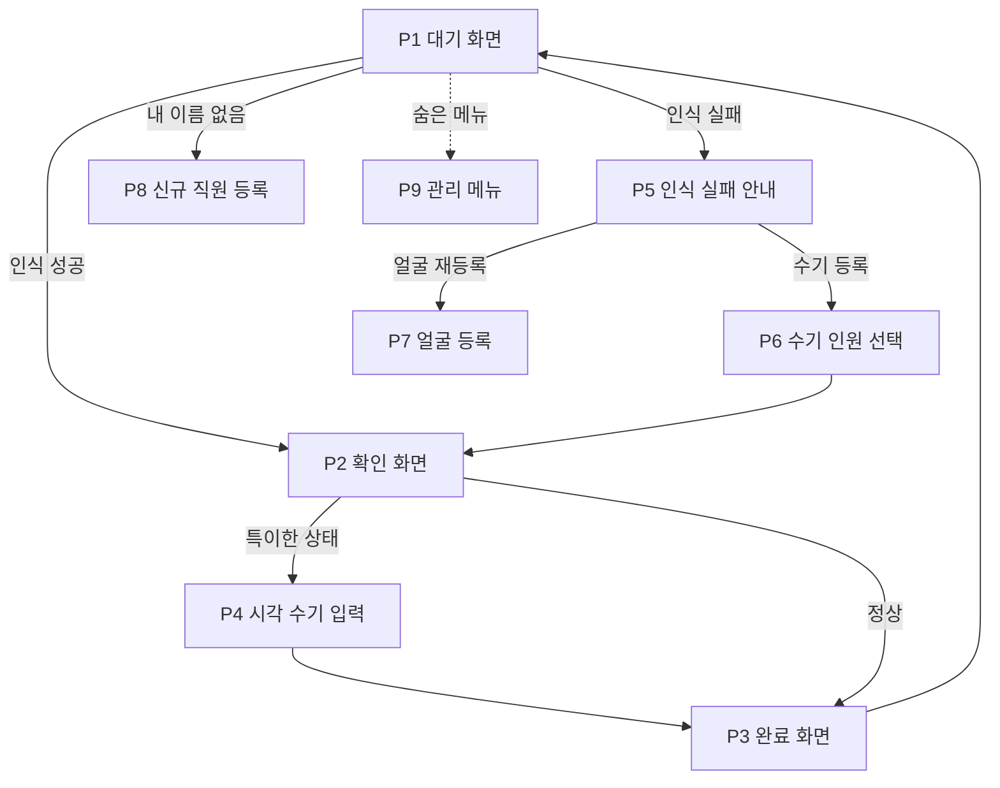

# 출퇴근·급여 관리 시스템 화면 명세서 (디자이너용)

2026-09-19 · @Someone

## 사용 안내

이 문서는 식당 직원 출퇴근·급여 관리 시스템의 두 제품, 매장 폰 앱과 관리자 웹앱의 화면을 디자인하기 위한 명세입니다. 화면마다 목적, 구성 요소, 버튼과 동작, 상태를 적었고, 동작 규칙의 자세한 근거는 별도의 설계서에 있습니다.

| 구분 | 매장 폰 앱 | 관리자 웹앱 |
| --- | --- | --- |
| 사용자 | 매장 직원과 알바. 하루에 여러 번 짧게 사용 | 사장 1명. 하루 1\~2번 확인하고 월말 정산 때 집중 사용 |
| 기기 | 안드로이드 폰(매장당 1대). 세로 고정, 거치대에 세워 두고 항상 충전하며 화면은 항상 켜져 있음. 기준 360×800dp | PC 브라우저(기준 너비 1440px)와 폰 홈 화면에 설치한 웹앱(기준 너비 390px). 같은 기능을 두 크기로 제공 |
| 사용 환경 | 바쁜 주방과 홀. 손이 젖어 있거나 급할 수 있고 50cm\~1m 거리에서 봄 | 조용한 사무 환경. 표와 숫자를 꼼꼼히 확인 |
| 핵심 요구 | 두 번의 터치 안에 출퇴근을 끝낼 것 | 확인이 필요한 일을 첫 화면에서 바로 처리할 것 |

### 디자인 조건

- 모든 화면은 한국어입니다. 시각은 24시간제(09:30), 날짜는 "9월 19일 (토)", 금액은 천 단위 쉼표와 "원"(1,150,000원), 근무시간은 "7시간 30분"으로 표기합니다.
- 폰 앱은 터치 영역을 최소 56dp로 하고, 이름과 버튼 글씨를 크게 합니다. 한 화면에는 한 가지 행동만 두고, 대기 화면을 제외한 모든 화면은 30초 동안 입력이 없으면 대기 화면으로 돌아갑니다.
- 폰 앱의 대기 화면은 카메라 영상이 화면 대부분을 차지하므로, 눈부심이 적은 어두운 계열의 테마를 권장합니다 (제안).
- 관리자 웹앱은 PC에서는 왼쪽 메뉴와 표 중심으로, 폰에서는 하단 탭과 카드 목록으로 구성합니다. 표는 폰에서 카드로 바뀝니다.
- 관리자 웹앱에서 항목을 수정할 때 PC에서는 오른쪽에서 열리는 패널을, 폰에서는 아래에서 올라오는 시트를 씁니다.
- 삭제, 거절, 정산 확정, 재오픈처럼 되돌리기 어려운 동작은 한 번 더 확인하는 대화상자를 거칩니다.
- 상태를 색만으로 구분하지 않고 아이콘이나 문구를 함께 씁니다.
- 브랜드 색, 글꼴, 아이콘 스타일은 디자이너가 정합니다.

## 화면 목록과 시안 순서

화면은 매장 폰 앱 10개와 관리자 웹앱 16개(대화상자 포함)입니다. 시안 순서 1은 시스템의 핵심이라 가장 먼저 디자인할 화면이고, 순서 3은 자주 쓰지 않는 화면입니다.

### 매장 폰 앱

| 번호 | 화면 | 한 줄 설명 | 시안 순서 |
| --- | --- | --- | --- |
| P1 | 대기 화면 | 카메라가 켜져 있고 얼굴이 인식되기를 기다림 | 1 |
| P2 | 확인 화면 | 인식된 이름을 보여주고 출근/퇴근 버튼으로 확정 | 1 |
| P3 | 완료 화면 | 기록이 끝났음을 3초간 알리고 대기 화면으로 복귀 | 1 |
| P7 | 얼굴 등록 | 이름 선택, 동의, 얼굴 촬영, 완료 순서로 진행 | 1 |
| P4 | 근무 시각 수기 입력 | 퇴근 없이 출근하거나 출근 없이 퇴근할 때 시각을 직접 입력 | 2 |
| P5 | 인식 실패 안내 | 인식이 여러 번 실패했을 때 선택지를 안내 | 2 |
| P6 | 수기 등록 인원 선택 | 이 폰에 등록된 인원 중에서 누구인지 직접 선택 | 2 |
| P8 | 신규 직원 임시 등록 | 목록에 이름이 없는 신규 직원이 이름을 적고 얼굴을 등록 | 2 |
| P9 | 관리 메뉴 | 동기화 상태, 인식 테스트, 처리방침, 기기 등록으로 가는 숨겨진 메뉴 | 3 |
| P10 | 기기 등록 | 관리자가 발급한 등록 코드를 입력해 이 폰을 매장에 연결 | 3 |

### 관리자 웹앱

| 번호 | 화면 | 한 줄 설명 | 시안 순서 |
| --- | --- | --- | --- |
| A2 | 대시보드 | 요청 카드와 오늘의 현황을 한눈에 보여주는 첫 화면 | 1 |
| A3 | 확인 필요 | 특이사항이 붙은 근무를 모아 한 번에 확인하고 고침 | 1 |
| A4 | 근무 기록 | 매장, 직원, 기간으로 근무 기록을 찾고 수정하고 추가 | 1 |
| A14 | 정산 | 기간을 정해 직원별 급여를 계산하고 확정 | 1 |
| A6 | 직원 관리 | 직원과 알바 목록, 상세 정보와 급여 설정 편집 | 2 |
| A7 | 직원 이동 대화상자 | 급여 관리 매장을 바꾸는 예약 | 2 |
| A8 | 급여 설정 변경 대화상자 | 시급이나 월급을 바꾸고 적용 시점을 선택 | 2 |
| A9 | 신규 직원 요청 수락 대화상자 | 폰에서 온 신규 직원 요청을 수락, 연결, 거절 | 2 |
| A11 | 얼굴 등록 승인 | 얼굴 등록 요청을 승인, 거절, 해제 | 2 |
| A13 | 보너스·공제 | 직원별 보너스와 결근 공제 등을 목적과 함께 등록 | 2 |
| A1 | 로그인 | 패스키로 로그인, QR 로그인, 복구 코드 | 3 |
| A5 | 근무시간 요약 | 직원과 근무 매장의 표로 누가 어디서 몇 시간 일했는지 확인 | 3 |
| A10 | 매장 관리 | 매장별 영업 마감시각과 자동 퇴근 유예시간 설정 | 3 |
| A12 | 기기 관리 | 매장 폰 등록 코드 발급, 접속 상태 확인, 비활성화 | 3 |
| A15 | 매장별 리포트 | 매장별 인건비와 근무시간, 직원별 급여 순위 | 3 |
| A16 | 설정 | 최저시급, 4대보험 요율, 휴일 달력, 가산율, 스위치, 계정, 감사 로그 | 3 |

표는 시안 순서대로 정렬했고, 번호는 이 문서 안에서 화면을 가리키는 이름표입니다. 화면 명세는 번호순으로 이어집니다.

### 매장 폰 앱의 화면 이동

P7과 P8은 대기 화면 구석의 \[얼굴 등록\] 버튼으로도 들어갑니다. P9에서는 P10 기기 등록으로 갈 수 있습니다.

### 관리자 웹앱의 메뉴 구성

| 메뉴 | 포함 화면 | 폰 하단 탭 |
| --- | --- | --- |
| 대시보드 | A2 (그 안에서 A9 대화상자와 A11 처리) | 탭 1 |
| 확인 필요 | A3. 메뉴 옆에 건수 배지 | 탭 2 "근무" 안의 필터 |
| 근무 | A4 근무 기록, A5 근무시간 요약 | 탭 2 |
| 정산 | A14 정산, A15 매장별 리포트, A13 보너스·공제 | 탭 3 |
| 관리 | A6 직원 관리(A7, A8 대화상자 포함), A10 매장, A11 얼굴 등록 승인, A12 기기 | 탭 4 |
| 설정 | A16 | 탭 5 |

A1 로그인은 로그아웃 상태에서만 보입니다.

## 공통 요소

여러 화면에서 반복해서 쓰는 배지, 상태 표시, 문구, 입력 컴포넌트입니다. 화면 명세에서는 이 이름을 그대로 가리킵니다.

### 특이사항 배지

근무 기록에 붙는 표시입니다. 심각도는 세 단계이고, 색과 아이콘은 디자이너가 정합니다.

| 화면에 보이는 이름 | 심각도 | 의미 |
| --- | --- | --- |
| 시각 이상 | 경고 | 폰의 시각과 서버가 받은 시각이 크게 다름 |
| 출근 중복 | 경고 | 이미 출근 중인데 출근이 또 들어옴 |
| 출근 누락 | 경고 | 출근 기록 없이 퇴근만 들어옴 |
| 자동 퇴근 | 주의 | 퇴근을 찍지 않아 매장 마감시각으로 처리됨 |
| 퇴근 수기 입력 | 주의 | 직원이 이전 근무의 퇴근 시각을 직접 적음 |
| 출근 수기 입력 | 주의 | 직원이 출근 시각을 직접 적음 |
| 수기 선택 | 주의 | 얼굴 인식이 실패해서 이름을 직접 골라 기록함 |
| 임시 직원 | 정보 | 관리자 수락 전인 신규 직원의 기록 |
| 관리자 수정 | 정보 | 관리자가 시각이나 값을 고침 |
| 관리자 추가 | 정보 | 관리자가 기록을 직접 추가함 |

배지 사용 규칙은 다음과 같습니다.

- 한 근무에 배지가 여러 개 붙을 수 있고, 목록에서는 심각도가 높은 순서로 최대 2개까지 보여주고 나머지는 "+2"처럼 줄여 표시합니다.
- 배지를 누르면(PC에서는 마우스를 올리면) 의미와 발생 시각을 설명하는 말풍선이 뜹니다.
- 관리자가 "확인 완료"를 누른 근무는 배지를 지우지 않고 흐리게 바꿉니다. 기록이 남아 있다는 것을 보여주기 위함입니다.

### 상태 표시

| 대상 | 상태 값 | 쓰이는 곳 |
| --- | --- | --- |
| 근무 | 근무 중, 퇴근 | 대시보드, 근무 기록 |
| 정산 | 초안, 확정 | 정산 |
| 얼굴 등록 | 승인 대기, 승인됨, 해제됨 | 직원 관리, 얼굴 등록 승인 |
| 신규 직원 요청 | 대기, 수락됨, 연결됨, 거절됨 | 대시보드, 신규 직원 요청 수락 |
| 기기 | 정상, 지연(동기화가 오래 밀림. 기준 시간은 개발 단계에서 정함), 비활성화 | 대시보드, 기기 관리 |
| 직원 구분 | 알바, 직원 | 직원 관리, 정산, 근무 기록 |
| 재직 | 재직, 퇴사 | 직원 관리 |

### 매장 폰 앱의 공통 표시

- **오프라인 배너**: 인터넷이 끊기면 화면 위쪽에 안내 띠를 보여줍니다. 오류가 아니라 안내라서 차분한 톤으로 하고, 출퇴근 기록은 평소처럼 진행됩니다. 문구 예: "인터넷 연결이 없어요. 기록은 이 폰에 저장되고, 연결되면 자동으로 전송돼요."
- **전송 대기 표시**: 아직 서버로 보내지 못한 기록이 있으면 대기 화면 구석에 "전송 대기 3건"처럼 작게 보여줍니다.
- **등록 확인 중 표시**: 관리자 승인 전인 직원은 확인 화면에서 이름 옆에 작게 "등록 확인 중"을 붙입니다.

### 빈 상태와 오류 문구 (제안)

| 상황 | 문구 |
| --- | --- |
| 확인 필요 목록이 비어 있음 | "확인할 근무가 없어요. 모두 정상이에요." |
| 신규 직원 요청이 없음 | "새 요청이 없어요." |
| 근무 기록 검색 결과가 없음 | "조건에 맞는 근무 기록이 없어요." |
| 정산 대상 근무가 없음 | "이 기간에 정산할 근무가 없어요." |
| 서버에 연결할 수 없음 (관리자 웹앱) | "서버에 연결할 수 없어요. 잠시 후 다시 시도해 주세요." 와 \[다시 시도\] 버튼 |
| 로그인 유효시간이 지남 | "로그인이 만료됐어요." 후 로그인 화면으로 이동 |

### 반복해서 쓰는 입력 컴포넌트

- **매장 선택**: "전체"와 3개 매장 이름을 나란히 놓는 칩 형태입니다.
- **기간 선택**: "이번 달", "지난 달", "직접 지정"(시작일과 종료일) 세 가지입니다.
- **시각 입력**: 시와 분을 큰 글씨로 돌려 고르는 방식입니다. 폰 앱과 관리자 웹앱이 같은 모양을 씁니다.
- **금액 입력**: 숫자만 입력하면 천 단위 쉼표가 자동으로 붙고, 오른쪽에 "원"이 고정되어 있습니다.
- **변경 사유 입력**: 근무 기록이나 급여를 고칠 때 쓰는 한 줄 입력칸입니다.
- **확인 대화상자**: 제목, 한 줄 설명, \[취소\]와 실행 버튼으로 구성합니다. 실행 버튼은 동작 이름을 그대로 씁니다(예: "삭제", "확정").
- **저장 알림**: 저장이 끝나면 화면 아래에 잠깐 "저장했어요"를 보여줍니다.

## 매장 폰 앱: 출퇴근 화면 (P1\~P6)

직원이 가장 자주 보는 화면들입니다. 세로 화면 기준이며, 바쁜 상황에서 멀리서도 읽을 수 있어야 합니다.

### P1 대기 화면

앱을 켜면 가장 먼저 보이는 기본 화면으로, 얼굴 인식이 성공하면 P2로, 여러 번 실패하면 P5로 넘어갑니다. 버튼을 누를 필요 없이 얼굴이 감지되면 자동으로 인식합니다.

| 요소 | 내용과 동작 |
| --- | --- |
| 카메라 영상 | 전면 카메라 영상이 화면 대부분을 차지함. 얼굴이 감지되면 얼굴을 따라다니는 가이드 틀이 나타나고, 감지 중과 인식 중일 때 모양이나 색이 달라짐 |
| 현재 시각과 날짜 | 상단에 크게 표시(예: 09:30, 9월 19일 (토)). 직원이 출퇴근 시각을 바로 확인할 수 있게 함 |
| 매장 이름 | 상단에 작게 표시 |
| 안내 문구 | 얼굴이 없을 때 "화면을 바라봐 주세요", 인식하는 동안 "확인하고 있어요" |
| 오프라인 배너, 전송 대기 표시 | 공통 요소 절 참고 |
| \[얼굴 등록\] 버튼 | 화면 아래쪽 구석에 눈에 덜 띄게 배치. 누르면 P7 |
| 숨은 메뉴 진입 | 화면 왼쪽 위 모서리를 5번 연속으로 누르면 P9 (제안). 눈에 보이는 버튼은 두지 않음 |

상태는 다음과 같습니다.

- 얼굴 없음, 얼굴 감지됨, 인식 중, 인식 성공(P2로 이동)을 구분합니다.
- 카메라를 쓸 수 없을 때는 영상 대신 "카메라를 사용할 수 없어요. 관리자에게 알려 주세요."를 보여줍니다.

### P2 확인 화면

인식된 사람이 맞는지 확인하고 \[출근\] 또는 \[퇴근\]으로 확정하는 화면입니다. P1에서 인식에 성공했거나 P6에서 이름을 골랐을 때 들어옵니다.

| 요소 | 내용과 동작 |
| --- | --- |
| 이름 | 화면 가운데에 가장 크게 "홍길동님" |
| 현재 상태 문구 | 이름 아래에 한 줄. 근무 중이면 "09:00부터 근무 중이에요", 아니면 "마지막 기록: 어제 22:10 퇴근" |
| 보조 표시 | 승인 전인 직원은 "등록 확인 중", P6에서 이름을 직접 골랐다면 "직접 선택했어요"를 작게 표시 |
| \[출근\] \[퇴근\] 버튼 | 화면 아래에 큰 두 버튼. 지금 상태에 맞는 쪽(근무 중이면 \[퇴근\], 아니면 \[출근\])을 크게 강조하고 다른 쪽은 작고 흐리게 하되 누를 수는 있음 |
| \[내가 아니에요\] 버튼 | 작은 텍스트 버튼(제안). 누르면 기록 없이 P1로 돌아감 |
| 자동 복귀 표시 | 30초 후 P1로 돌아간다는 것을 화면 가장자리의 가느다란 진행 띠로 표시 |

버튼을 눌렀을 때의 동작은 다음과 같습니다.

- 정상이면 기록을 저장하고 P3로 이동합니다.
- &#91;출근\]을 눌렀는데 이미 출근 중이면 P4의 "퇴근 없이 출근" 화면으로 갑니다.
- &#91;퇴근\]을 눌렀는데 출근 기록이 없으면 P4의 "출근 없이 퇴근" 화면으로 갑니다.
- 같은 직원이 60초 안에 다시 누르면 "방금 기록했어요"라는 안내와 \[확인\] 버튼만 보여줍니다.

### P3 완료 화면

기록이 끝났음을 3초 동안 알리고 P1로 자동으로 돌아갑니다.

| 요소 | 내용과 동작 |
| --- | --- |
| 결과 표시 | 큰 체크 아이콘과 문구. 출근이면 "홍길동님, 09:30 출근했어요", 퇴근이면 "홍길동님, 18:00 퇴근했어요. 수고하셨어요". 출근과 퇴근이 한눈에 구분되도록 색이나 아이콘을 다르게 함 |
| 오늘 근무 시간 | 퇴근일 때만 아래에 "오늘 근무 7시간 30분" (제안) |
| \[취소\] 버튼 | 3초 동안만 보이는 작은 버튼(제안). 잘못 눌렀을 때 방금 기록을 없앰. 이 3초 동안은 서버로의 전송을 보류하는 것으로 개발팀과 맞춤 |
| 진행 띠 | 3초가 지나면 P1로 돌아간다는 것을 보여줌 |
| 저장 안내 | 오프라인일 때 "이 폰에 저장했어요. 연결되면 전송돼요"를 작게 표시 |

### P4 근무 시각 수기 입력

기록이 어긋난 두 가지 경우에 P2 위로 올라오는 아래쪽 시트입니다. 시각을 저장하면 P3로 이동하고, 직접 입력한 시각은 서버에 특이사항으로 남습니다.

**P4-a: 퇴근 없이 출근**

| 요소 | 내용과 동작 |
| --- | --- |
| 제목과 설명 | "오늘 이미 출근한 기록이 있어요." 아래에 "이전 근무를 종료하고 출근 처리를 할까요?" |
| 이전 출근 시각 | "이전 출근: 어제 18:00"처럼 참고용으로 표시 |
| 시각 입력 | 라벨은 "이전 근무 퇴근 시각". 이전 출근 시각 이후부터 지금 이전까지만 고를 수 있고, 범위 밖은 흐리게 선택 불가로 함 |
| \[이전 근무 종료하고 출근\] 버튼 | 주요 버튼. 시각을 고르기 전에는 비활성. 누르면 이전 근무를 종료하고 새 출근을 기록한 뒤 P3로 이동 |
| \[취소\] 버튼 | 시트를 닫고 P2로 돌아감 |
| 안내 문구 | "직접 입력한 시각은 관리자에게 표시돼요." 작게 표시 |

**P4-b: 출근 없이 퇴근**

| 요소 | 내용과 동작 |
| --- | --- |
| 제목과 설명 | "오늘 출근 기록이 없어요." 아래에 "출근 시간을 수기로 쓸까요?" |
| 시각 입력 | 라벨은 "출근 시각". 지금 이전 시각만 고를 수 있음 |
| \[출근 시간 입력하고 퇴근\] 버튼 | 주요 버튼. 시각을 고르기 전에는 비활성. 누르면 출근과 퇴근을 함께 기록한 뒤 P3로 이동 |
| \[취소\] 버튼 | 시트를 닫고 P2로 돌아감 |
| 안내 문구 | "직접 입력한 시각은 관리자에게 표시돼요." 작게 표시 |

두 시트 모두 잘못된 시각을 고르면 입력칸 아래에 "이전 출근보다 늦은 시각을 골라 주세요"처럼 이유를 알려 줍니다.

### P5 인식 실패 안내

얼굴 인식이 연속으로 3번 실패했을 때 P1 위에 보여주는 안내입니다 (횟수는 제안).

| 요소 | 내용과 동작 |
| --- | --- |
| 제목과 설명 | "인식되지 않았어요." 아래에 "다시 시도하거나, 얼굴을 다시 등록해 주세요." |
| \[다시 시도\] 버튼 | 주요 버튼. P1로 돌아감 |
| \[얼굴 재등록\] 버튼 | P7을 재등록 모드로 엶 |
| \[수기로 등록\] 버튼 | 덜 강조된 보조 버튼. P6으로 이동. 관리자가 설정에서 이 옵션을 끄면 버튼이 보이지 않음 |
| 자동 복귀 | 30초 동안 입력이 없으면 P1로 돌아감 |

### P6 수기 등록 인원 선택

얼굴 인식 없이 이 폰에 등록된 인원 중에서 누구인지 직접 고르는 화면입니다.

| 요소 | 내용과 동작 |
| --- | --- |
| 제목과 안내 | "이름을 골라 주세요." 아래에 "얼굴 인식 없이 기록하면 관리자에게 표시돼요." |
| 인원 목록 | 가나다순의 큰 이름 버튼 목록. 이 폰에 등록된 인원, 임시 등록 중인 직원, 얼굴 등록 면제로 지정된 직원만 나옴. 인원이 많으면 스크롤 |
| \[뒤로\] 버튼 | P5로 돌아감 |
| 이름 선택 동작 | 이름을 누르면 P2로 이동("직접 선택했어요" 표시) |

목록이 비어 있으면 "이 폰에 등록된 직원이 없어요. 관리자에게 문의해 주세요."를 보여줍니다.

## 매장 폰 앱: 얼굴 등록과 관리 화면 (P7\~P10)

얼굴 등록은 여러 단계로 이어지는 화면이라 상단에 단계 표시(이름, 동의, 촬영, 완료)를 둡니다. 이 절의 화면들은 자주 쓰지는 않지만, 처음 쓰는 직원이 혼자서 끝낼 수 있을 만큼 쉬워야 합니다.

### P7 얼굴 등록

이미 목록에 이름이 있는 직원이 본인 얼굴을 등록하는 화면입니다. P1의 \[얼굴 등록\] 버튼이나 P5의 \[얼굴 재등록\] 버튼으로 들어오고, 재등록일 때는 같은 화면이 재등록 모드로 열립니다.

**1단계: 이름 선택**

| 요소 | 내용과 동작 |
| --- | --- |
| 제목 | "등록할 분의 이름을 골라 주세요." |
| 이름 목록 | 서버에서 받은 이 매장 근무 가능 직원을 가나다순의 큰 버튼으로 표시. 이미 이 폰에 등록된 직원은 이름 옆에 "등록됨"을 표시하고, 누르면 재등록으로 진행 |
| \[내 이름이 없어요\] 버튼 | 목록 맨 아래. 누르면 P8로 이동 |
| \[뒤로\] 버튼 | P1로 돌아감 |

**2단계: 동의**

| 요소 | 내용과 동작 |
| --- | --- |
| 제목 | "얼굴 정보 수집·이용 동의" |
| 요약 본문 | 다섯 줄 안팎으로 정리. 목적(출퇴근 확인), 수집 항목(얼굴 특징정보), 보관 방식(이 폰 안에서만 암호화해 저장하고 서버로 보내지 않으며 사진 원본은 저장하지 않음), 보유 기간(퇴사나 동의 철회 때까지), 동의하지 않아도 불이익이 없다는 안내 |
| \[전문 보기\] 링크 | 개인정보 처리방침 전문을 스크롤 화면으로 엶 |
| 동의 체크 | "위 내용에 동의합니다" 체크박스 |
| \[동의하고 계속\] 버튼 | 체크하기 전에는 비활성. 누르면 3단계로 이동 |
| \[동의하지 않아요\] 버튼 | 누르면 "관리자에게 문의해 주세요. 얼굴 등록 없이도 출퇴근할 수 있어요."를 보여주고 P1로 돌아감 |

**3단계: 촬영**

| 요소 | 내용과 동작 |
| --- | --- |
| 카메라 영상과 가이드 틀 | 전면 카메라 영상 위에 얼굴 위치를 맞추는 틀 |
| 진행 표시 | "3 / 6"처럼 몇 번째 촬영인지 점이나 숫자로 표시 (6장 안팎) |
| 방향 안내 | 정면, 왼쪽으로 살짝, 오른쪽으로 살짝, 위, 아래 순서로 어느 쪽을 보라는 화살표와 문구 |
| 품질 피드백 | 상태가 나쁘면 즉시 알려 줌. 예: "너무 어두워요", "조금 더 가까이 와 주세요", "흔들렸어요", "얼굴을 가운데에 맞춰 주세요" |
| 촬영 방식 | 조건이 맞으면 자동으로 촬영되고 셔터 버튼은 없음 |
| \[다시 찍기\] 버튼 | 현재 단계의 촬영을 다시 함 |
| \[취소\] 버튼 | 등록을 중단하고 P1로 돌아가며 아무것도 저장하지 않음 |

촬영 중 이미 등록된 다른 직원과 얼굴이 너무 비슷하면 오류 화면을 보여줍니다. 문구 예: "이미 등록된 다른 분과 얼굴이 너무 비슷해요. 이름을 다시 확인해 주세요." 버튼은 \[이름 다시 고르기\]와 \[관리자에게 문의\]입니다.

**4단계: 완료**

| 요소 | 내용과 동작 |
| --- | --- |
| 결과 표시 | 체크 아이콘과 "등록했어요" |
| 안내 문구 | "관리자가 확인하면 등록이 끝나요. 그 전에도 출퇴근은 할 수 있어요." 재등록일 때는 "새 얼굴은 관리자가 확인하면 바뀌어요. 그때까지는 기존 얼굴로 인식돼요." |
| \[출퇴근하러 가기\] 버튼 | P1로 이동 |

### P8 신규 직원 임시 등록

첫 출근인데 목록에 이름이 없는 직원이 이름을 직접 적고 얼굴을 등록하는 화면입니다. P7의 \[내 이름이 없어요\]로 들어옵니다. 동의와 촬영 단계는 P7과 같은 화면을 씁니다.

**1단계: 이름 입력**

| 요소 | 내용과 동작 |
| --- | --- |
| 제목과 안내 | "이름을 적어 주세요." 아래에 "관리자에게 확인 요청이 가요. 확인 전에도 출퇴근은 할 수 있어요." |
| 이름 입력칸 | 한글 키보드가 바로 열림. 한 줄 |
| \[다음\] 버튼 | 이름을 입력하기 전에는 비활성. 누르면 P7의 동의 단계로 이동 |
| \[뒤로\] 버튼 | P7의 이름 선택으로 돌아감 |
| 이름 중복 안내 | 입력한 이름이 목록에 이미 있으면 "같은 이름이 목록에 있어요. 목록에서 골라 주세요."와 \[목록에서 고르기\] 버튼을 보여줌 (제안) |

**마지막 단계: 요청 완료**

| 요소 | 내용과 동작 |
| --- | --- |
| 결과 표시 | 체크 아이콘과 "요청을 보냈어요" |
| 안내 문구 | "관리자가 확인하면 정식으로 등록돼요. 그 전에도 출퇴근은 할 수 있어요." 오프라인이면 "인터넷이 연결되면 요청이 전송돼요"를 덧붙임 |
| \[출퇴근하러 가기\] 버튼 | P1로 이동 |

요청이 나중에 거절되면, 다음에 P1을 열 때 "등록 요청이 거절되어 저장한 이름과 얼굴 정보를 지웠어요. 관리자에게 문의해 주세요."라는 안내를 한 번 보여줍니다.

### P9 관리 메뉴

직원이 실수로 열지 않도록 P1의 숨은 진입(모서리 5번 탭)으로만 열리는 화면입니다. 매장 관리자나 개발자가 쓰는 화면이라 꾸밈은 최소로 해도 됩니다.

| 요소 | 내용과 동작 |
| --- | --- |
| 동기화 상태 | 마지막 동기화 시각, 전송 대기 건수, \[지금 동기화\] 버튼 |
| 이 폰 정보 | 매장 이름, 기기 이름, 앱 버전, 서버 연결 상태 |
| 인식 테스트 | 누르면 카메라로 인식을 시험하는 화면이 열림. 인식된 이름과 유사도 점수를 숫자로 보여 주며 기록은 남기지 않음. \[나가기\] 버튼 있음 |
| 개인정보 처리방침 | 처리방침 전문을 스크롤 화면으로 엶 |
| 기기 다시 등록 | 누르면 P10으로 이동 |
| \[닫기\] 버튼 | P1로 돌아감 |

### P10 기기 등록

이 폰을 매장에 연결하는 화면입니다. 앱을 처음 켰을 때 자동으로 열리고, 등록이 끝나기 전에는 다른 화면으로 갈 수 없습니다.

| 요소 | 내용과 동작 |
| --- | --- |
| 제목과 설명 | "이 폰을 매장에 연결해요." 아래에 "관리자 웹앱에서 받은 등록 코드를 입력해 주세요. 코드는 10분 동안 유효해요." |
| 코드 입력칸 | 큰 칸으로 나뉜 입력칸과 숫자·영문 키패드. 자릿수는 개발 단계에서 정함 |
| \[연결하기\] 버튼 | 코드를 다 입력하기 전에는 비활성. 누르면 확인하는 동안 로딩 표시 |
| 성공 | "연결됐어요"와 매장 이름을 잠깐 보여 준 뒤 P1로 이동 |
| 실패 | "코드가 맞지 않거나 시간이 지났어요. 관리자 웹앱에서 새 코드를 받아 주세요." |
| 오프라인 | "인터넷에 연결한 뒤 다시 시도해 주세요." |

## 관리자 웹앱: 로그인, 대시보드, 근무 화면 (A1\~A5)

사장이 매일 열어 보는 화면들입니다. PC에서는 왼쪽 메뉴와 표를, 폰에서는 하단 탭과 카드를 씁니다. 표는 폰에서 카드 목록으로 바뀌고, 각 카드에는 표의 열이 항목 이름과 값의 쌍으로 들어갑니다.

### A1 로그인

로그아웃 상태에서만 보이는 화면으로, 비밀번호 없이 패스키(폰의 지문·얼굴 인증)로 로그인합니다.

| 요소 | 내용과 동작 |
| --- | --- |
| 이름과 로고 | 시스템 이름을 가운데에 배치 |
| \[패스키로 로그인\] 버튼 | 큰 주요 버튼. 누르면 기기의 지문·얼굴 인증 창이 뜸. 폰에서는 이 버튼이 기본 경로 |
| QR 로그인 영역 | PC에서만 표시. QR 코드와 "폰으로 QR을 스캔해 승인하세요" 안내 |
| \[복구 코드로 로그인\] 링크 | 작은 텍스트 링크. 누르면 코드 입력칸과 \[로그인\] 버튼이 나오는 화면으로 바뀜 |

상태는 다음과 같습니다.

- 승인 대기: QR이나 패스키 인증을 기다리는 동안 "폰에서 승인해 주세요"와 로딩 표시
- 실패: "로그인하지 못했어요. 다시 시도해 주세요."
- 시도 횟수 초과: "잠시 후 다시 시도해 주세요."

패스키를 처음 등록하는 화면은 설정(A16)의 관리자 계정 탭에 있습니다.

### A2 대시보드

로그인하면 처음 보이는 화면입니다. 위쪽에는 사장이 바로 처리해야 할 요청을, 아래쪽에는 오늘의 현황을 둡니다.

| 영역 | 내용과 동작 |
| --- | --- |
| 제목 줄 | "대시보드", 오늘 날짜, 매장 선택 칩(전체와 3개 매장). 매장을 고르면 아래 현황이 그 매장만 보임 |
| 기기 경고 배너 | 동기화가 오래 밀린 폰이 있을 때만 표시. 예: "○○점 폰이 1시간 넘게 연결되지 않았어요"와 \[기기 관리로 이동\] 버튼 |
| 신규 직원 요청 카드 | 요청이 있을 때 "신규 직원 요청 N건" 제목과 요청 목록. 행마다 이름, 요청한 매장, 요청 시각, 이미 쌓인 근무 기록 건수와 세 버튼 \[수락\] \[기존 직원에 연결\] \[거절\]. 버튼을 누르면 A9 대화상자가 열림. 요청이 없으면 "새 요청이 없어요" 한 줄만 보임 |
| 얼굴 등록 승인 카드 | 대기가 있을 때 "얼굴 등록 승인 대기 N건" 제목과 목록. 행마다 직원 이름, 매장(기기), 요청 시각, 재등록 여부와 \[승인\] \[거절\] 버튼. \[승인\]은 바로 처리하고 "승인했어요" 알림에 \[되돌리기\]를 붙임. \[거절\]은 확인 대화상자를 거침 |
| 확인 필요 요약 | "확인 필요 N건"을 큰 숫자로 보여 주고, 아래에 배지별 건수(자동 퇴근 2, 수기 입력 1처럼)를 나열. \[확인하러 가기\] 버튼은 A3으로 이동. 0건이면 "확인할 근무가 없어요. 모두 정상이에요." |
| 매장별 현재 근무 현황 | 매장마다 카드 하나. 매장 이름, 지금 근무 중인 인원 수, 근무 중인 사람의 이름과 출근 시각 목록, 그 매장 폰의 마지막 동기화 시각과 기기 상태 |

배치는 PC에서 신규 직원 요청 카드와 얼굴 등록 승인 카드를 나란히 놓고, 그 아래에 확인 필요 요약, 그 아래에 매장별 카드 3개를 나란히 둡니다. 폰에서는 같은 순서로 세로로 쌓습니다.

### A3 확인 필요

특이사항 배지가 붙은 근무를 모아서 확인하고 고치는 화면입니다. 하루에 한 번 열어서 빠르게 처리하는 용도입니다.

| 요소 | 내용과 동작 |
| --- | --- |
| 제목과 건수 | "확인 필요" 옆에 "12건" |
| 필터 | 매장 칩, 배지 종류 칩(자동 퇴근, 수기 입력, 수기 선택, 시각 이상, 출근 중복·누락, 임시 직원), 기간 선택기(기본 "이번 달"), "확인 완료 항목도 보기" 스위치(기본 꺼짐) |
| 목록 | 열은 날짜, 직원(구분 라벨 포함), 근무 매장, 출근, 퇴근, 근무시간, 배지. 최근 순서. 폰에서는 카드로 표시 |
| 행의 \[수정\] 버튼 | A4의 수정 패널을 같은 모양으로 엶. 저장하면 "관리자 수정" 배지가 붙고 이 목록에서 빠짐 |
| 행의 \[확인 완료\] 버튼 | 시각을 고치지 않고 "이대로 맞다"고 처리. 배지는 흐려지고 목록에서 빠짐 |
| 여러 건 선택 | 행 왼쪽 체크박스. 하나 이상 선택하면 위쪽에 \[선택 항목 확인 완료\] 버튼이 나타남 |

목록이 비어 있으면 공통 요소의 빈 상태 문구를 보여줍니다.

### A4 근무 기록

모든 근무 기록을 찾아서 보고, 고치고, 직접 추가하는 화면입니다. 매장별, 직원별로 누가 어느 매장에서 몇 시간 일했는지를 이 화면에서 확인하고 수정합니다.

| 요소 | 내용과 동작 |
| --- | --- |
| 필터 줄 | 매장 칩, 직원 선택(이름 검색이 되는 드롭다운), 기간 선택기, 상태(전체, 근무 중, 퇴근), 특이사항(전체, 있는 것만, 배지 종류 선택) |
| \[근무 기록 추가\] 버튼 | 오른쪽 위. 누르면 추가 패널이 열림 |
| 목록 | 열은 날짜(영업일), 직원(구분 라벨 포함), 근무 매장, 출근, 퇴근, 근무시간, 배지. 퇴근이 없는 근무는 "근무 중"으로 표시. 폰에서는 카드 |
| 합계 줄 | 목록 맨 아래에 현재 필터 결과의 근무시간 합계 |
| 행 선택 | 행을 누르면 수정 패널이 열림 |

**수정 패널**

| 요소 | 내용과 동작 |
| --- | --- |
| 직원 | 읽기 전용으로 이름과 구분 |
| 근무 매장 | 선택 상자로 바꿀 수 있음 |
| 출근 시각, 퇴근 시각 | 날짜와 시각 입력기. 퇴근은 비워 두어 "근무 중"으로 둘 수 있음 |
| 메모 | 자유 입력 |
| 변경 사유 | 한 줄 입력. 시각을 바꿀 때 입력을 권장하는 안내를 표시 |
| 폰 원본 기록 | 참고용 읽기 전용 영역. 예: "출근 09:02 (직원이 직접 입력, 폰 시각 09:40)". 배지도 함께 보여줌 |
| \[저장\] \[취소\] 버튼 | \[저장\]은 저장 알림을 띄우고 패널을 닫음. 저장하면 "관리자 수정" 배지가 붙음 |
| \[삭제\] 버튼 | 패널 아래쪽에 위험 색으로 배치. 누르면 확인 대화상자("이 근무 기록을 삭제할까요?")를 거침 |
| 변경 이력 | 접었다 펼 수 있는 목록. 항목마다 수정 시각, 무엇을 어떻게 바꿨는지(변경 전 → 변경 후), 사유 |

**추가 패널**

직원 선택, 근무 매장 선택, 날짜, 출근 시각, 퇴근 시각, 변경 사유를 입력하고 \[추가\] 버튼으로 저장합니다. 저장하면 "관리자 추가" 배지가 붙습니다.

**확정된 정산에 포함된 근무를 열었을 때**

패널 위에 "이 근무는 확정된 정산에 포함돼 있어요. 수정하려면 정산을 재오픈해야 해요." 안내를 보여주고, 입력칸과 \[저장\] 버튼을 비활성으로 만듭니다. 안내 옆에 \[정산으로 이동\] 버튼을 둡니다.

### A5 근무시간 요약

한 정산 기간 동안 누가 어느 매장에서 몇 시간 일했는지를 표 하나로 보는 화면입니다.

| 요소 | 내용과 동작 |
| --- | --- |
| 필터 줄 | 기간 선택기(기본은 현재 정산 기간), 구분(전체, 알바, 직원) |
| 표 | 행은 직원, 열은 3개 매장과 합계. 직원 이름 옆에 급여 관리 매장을 작은 라벨로 표시. 셀에는 근무시간(예: 37시간 30분)을 표시하고, 일한 적이 없는 매장은 빈 칸("-") |
| 합계 줄 | 표 맨 아래에 매장별 합계와 전체 합계 |
| 셀 선택 | 셀을 누르면 그 직원, 그 매장, 그 기간으로 필터된 A4로 이동 |

폰에서는 표 대신 직원별 카드를 쓰고, 카드 안에 매장별 근무시간과 합계를 줄로 나열합니다.

## 관리자 웹앱: 직원과 매장 화면 (A6\~A12)

직원, 매장, 폰을 관리하는 화면들입니다. 급여 금액이 보이는 화면이므로 사장 계정으로만 열립니다.

### A6 직원 관리

직원과 알바의 목록을 보고, 새로 추가하고, 한 사람을 눌러 상세 정보와 급여 설정을 고치는 화면입니다.

| 요소 | 내용과 동작 |
| --- | --- |
| 필터 줄 | 이름 검색, 구분 칩(전체, 알바, 직원), 재직 칩(재직, 퇴사, 전체), 급여 관리 매장 칩 |
| \[직원 추가\] 버튼 | 오른쪽 위. 누르면 추가 패널이 열림 |
| 목록 | 열은 이름, 구분 라벨, 급여 관리 매장, 근무 가능 매장(작은 칩), 현재 시급 또는 월급(월급은 "월 2,500,000원"), 얼굴 등록 현황(매장 3곳마다 등록됨, 대기, 없음을 작은 아이콘으로), 재직 상태. 폰에서는 카드 |
| 행 선택 | 행을 누르면 상세가 열림. PC에서는 오른쪽의 넓은 패널, 폰에서는 전체 화면 |

**추가 패널**

이름, 구분(알바 또는 직원), 급여 관리 매장, 근무 가능 매장(체크박스), 입사일, 시급 또는 월급을 입력합니다. 알바의 시급을 비우면 최저시급이 적용된다는 안내를 보여주고, 급여 설정 스위치(주휴수당, 야간 가산, 휴일 가산, 4대보험 4개)는 모두 "미적용"으로 시작합니다. \[취소\]와 \[추가\] 버튼이 있습니다.

**상세: 탭 4개**

| 탭 | 내용과 동작 |
| --- | --- |
| 기본 정보 | 이름, 구분, 급여 관리 매장(읽기 전용)과 \[이동\] 버튼(A7로), 근무 가능 매장 체크박스, 입사일, 재직 상태, "얼굴 등록 면제" 스위치(설명: 얼굴 등록을 원치 않는 직원은 수기 등록 목록에 항상 포함돼요). \[저장\] 버튼과, 아래쪽 위험 영역의 \[퇴사 처리\] 버튼. 퇴사 처리는 확인 대화상자("퇴사 처리하면 매장 폰에서 이 직원의 얼굴 데이터가 삭제돼요")를 거침 |
| 급여 설정 | 지금 적용 중인 설정 요약 카드(시급 또는 월급, 주휴수당, 야간 가산, 휴일 가산, 4대보험 4개의 적용 여부), 예약된 변경이 있으면 "10월 1일부터 적용 예정" 표시, \[급여 설정 변경\] 버튼(A8로). 아래에 변경 이력 표(적용 시작일, 시급 또는 월급, 설정 요약, 등록 시각)가 있고 읽기 전용. 직원(월급제)은 주휴수당, 야간, 휴일 항목을 숨김 |
| 얼굴 등록 | 매장(폰)별 표. 열은 매장, 상태(승인 대기, 승인됨, 해제됨), 요청·승인 시각과 상태에 맞는 버튼(\[승인\], \[해제\]) |
| 이동 이력 | 표. 열은 적용 시작일, 급여 관리 매장, 사유. 아직 적용 전인 예약은 "예정"으로 표시하고 \[예약 취소\] 버튼을 붙임 (제안) |

### A7 직원 이동 대화상자

급여 관리 매장을 바꾸는 예약을 만드는 대화상자입니다. A6의 \[이동\] 버튼으로 엽니다.

| 요소 | 내용과 동작 |
| --- | --- |
| 제목과 현재 매장 | "홍길동 직원 이동"과 "현재 급여 관리 매장: 강남점" |
| 새 급여 관리 매장 | 현재 매장을 뺀 나머지 매장 중에서 고르는 선택 상자 |
| 적용일 | 읽기 전용 안내. "10월 1일부터 적용돼요. 이동은 다음 달부터 적용됩니다." |
| 사유 | 한 줄 입력 |
| 이전 매장 처리 | 라디오 두 개. "계속 근무 가능(겸직)"과 "근무 가능에서 제거". 제거를 고르면 "이전 매장 폰의 얼굴 등록이 해제되고 얼굴 데이터가 삭제돼요"라는 경고 문구가 나타남 |
| 안내 문구 | "새 매장은 지금부터 근무 가능 매장에 추가돼요. 급여는 적용일부터 새 매장으로 넘어가요." |
| \[취소\] \[이동 예약\] 버튼 | 저장하면 "이동을 예약했어요" 알림 |

### A8 급여 설정 변경 대화상자

시급이나 월급, 수당과 4대보험 설정을 바꾸고 언제부터 적용할지 고르는 대화상자입니다. A6의 급여 설정 탭에 있는 \[급여 설정 변경\] 버튼으로 엽니다.

| 요소 | 내용과 동작 |
| --- | --- |
| 제목 | "급여 설정 변경"과 대상 직원 이름, 구분 |
| 시급(알바) | 금액 입력. 비워 두면 최저시급이 적용되고, 현재 최저시급을 옆에 표시. 최저시급보다 낮게 입력하면 입력칸이 경고 상태가 되고 "최저시급(○○원)보다 낮아요" 문구가 나오며, 저장할 때 한 번 더 확인하는 체크가 필요함 |
| 월급(직원) | 금액 입력 |
| 스위치 | 알바는 주휴수당, 야간 가산, 휴일 가산 스위치 3개. 알바와 직원 모두 국민연금, 건강보험, 장기요양, 고용보험 스위치 4개 |
| 적용 시점 | 카드 형태의 라디오 두 개. "이번 정산 기간부터 (9월 1일부터 소급 적용)"와 "다음 정산 기간부터 (10월 1일부터)". 이번 정산 기간이 이미 확정된 경우 첫 번째 카드는 비활성으로 하고 "이번 기간은 이미 확정됐어요"를 표시 |
| 미리보기 | 알바의 시급을 바꾸고 "이번 정산 기간부터"를 고르면 "이번 정산 금액이 1,100,000원에서 1,210,000원으로 바뀌어요 (+110,000원)"처럼 차이를 보여줌 (제안) |
| \[취소\] \[저장\] 버튼 | 저장하면 적용 시작일이 이력에 기록됨 |

### A9 신규 직원 요청 수락 대화상자

매장 폰에서 온 신규 직원 요청을 처리하는 대화상자입니다. 대시보드(A2)의 카드에서 \[수락\], \[기존 직원에 연결\], \[거절\] 중 하나를 누르면 그에 맞는 모드로 열립니다.

위쪽에는 모드와 상관없이 요청 정보를 보여줍니다. 입력한 이름, 요청한 매장, 요청 시각, 이미 쌓인 근무 기록 요약(예: 3건, 첫 출근 어제 17:55)입니다.

| 모드 | 요소 | 내용과 동작 |
| --- | --- | --- |
| 수락 | 입력 항목 | 이름(요청에 적힌 이름이 기본값이고 고칠 수 있음), 구분(알바 또는 직원, 필수), 급여 관리 매장(요청한 매장이 기본값), 근무 가능 매장(요청한 매장이 기본 체크), 입사일(첫 근무일이 기본값), 시급 또는 월급(알바는 비우면 최저시급), 급여 설정 스위치(모두 미적용으로 시작) |
| 수락 | 안내와 버튼 | "수락하면 이 직원의 얼굴 등록도 함께 승인되고, 쌓인 근무 기록이 이 직원 것으로 옮겨져요." \[취소\]와 \[수락하고 등록\] 버튼 |
| 기존 직원에 연결 | 입력 항목 | 이름 검색이 되는 직원 선택 상자. 요청한 이름과 비슷한 직원을 위에 추천 |
| 기존 직원에 연결 | 안내와 버튼 | "이름을 잘못 적었거나 이미 있는 직원이에요. 쌓인 근무 기록과 얼굴 정보가 선택한 직원에게 합쳐져요." \[취소\]와 \[연결\] 버튼 |
| 거절 | 입력 항목 | 사유(선택) 한 줄 |
| 거절 | 안내와 버튼 | "거절하면 쌓인 임시 근무 기록이 삭제되고, 폰에 저장된 이름과 얼굴 정보도 지워져요." \[취소\]와 \[거절\] 버튼(위험 색) |

### A10 매장 관리

매장별 영업 마감시각과 자동 퇴근 규칙을 설정하는 화면입니다.

| 요소 | 내용과 동작 |
| --- | --- |
| 목록 | 매장마다 카드 하나. 매장 이름, 영업 마감시각(예: 22:00), 자정을 넘기는 마감인지 여부(예: "다음날 02:00"), 자동 퇴근 유예시간(분), 근무 가능 직원 수, 폰 상태 |
| \[수정\] 버튼 | 카드마다. 누르면 수정 패널이 열림 |
| \[매장 추가\] 버튼 | 오른쪽 위. 이름과 마감 설정을 입력하는 같은 패널이 열림 |

수정 패널에는 매장 이름, 영업 마감시각(시각 입력기), "다음날 마감" 스위치, 자동 퇴근 유예시간(분 입력)이 있고 \[취소\]와 \[저장\] 버튼이 있습니다. 유예시간 입력칸 아래에 "마감 후 이 시간이 지나도 퇴근이 없으면 마감시각으로 자동 퇴근 처리돼요. 기록되는 퇴근 시각은 항상 마감시각이에요."라는 설명을 둡니다.

### A11 얼굴 등록 승인

직원이 매장 폰에서 요청한 얼굴 등록을 승인하거나 거절하고, 이미 승인된 등록을 해제하는 화면입니다.

| 요소 | 내용과 동작 |
| --- | --- |
| 탭 | "승인 대기"와 "처리 완료" |
| 목록 | 열은 직원 이름, 매장(폰), 요청 시각, 종류(신규 또는 재등록), 동의 시각. 폰에서는 카드 |
| 승인 대기 행의 버튼 | \[승인\]은 바로 처리하고 되돌리기 알림을 띄움. 재등록일 때는 "승인하면 새 얼굴로 교체돼요" 문구를 함께 보여줌. \[거절\]은 확인 대화상자를 거침 |
| 처리 완료 행의 버튼 | 승인된 행에 \[해제\]. 확인 대화상자 문구는 "해제하면 폰이 다음 동기화 때 이 직원의 얼굴 데이터를 삭제해요." |

신규 직원 요청(목록에 이름이 없어서 온 요청)은 이 화면이 아니라 대시보드의 신규 직원 요청 카드와 A9에서 처리한다는 안내를 화면 위쪽에 작게 붙입니다.

### A12 기기 관리

매장 폰을 등록하고 접속 상태를 확인하는 화면입니다.

| 요소 | 내용과 동작 |
| --- | --- |
| 목록 | 열은 기기 이름, 매장, 상태(정상, 지연, 비활성화), 마지막 접속 시각, 앱 버전. 폰에서는 카드 |
| \[등록 코드 발급\] 버튼 | 오른쪽 위. 누르면 발급 대화상자가 열림 |
| 행의 메뉴 | \[이름 수정\], \[비활성화\]. 비활성화는 확인 대화상자("이 폰은 더 이상 서버에 접속할 수 없어요.")를 거침 |

**등록 코드 발급 대화상자**

매장 선택과 기기 이름 입력 후 \[발급\] 버튼을 누르면 화면이 바뀌어 등록 코드를 아주 크게 보여줍니다. 코드 아래에 남은 유효 시간(10분부터 줄어드는 카운트다운), \[코드 복사\] 버튼, "매장 폰의 앱에 이 코드를 입력해 주세요" 안내를 둡니다. 시간이 지나면 "코드가 만료됐어요"와 \[새 코드 발급\] 버튼으로 바뀝니다.

## 관리자 웹앱: 정산과 설정 화면 (A13\~A16)

월말에 가장 오래 머무는 화면들입니다. 금액과 근거가 정확하게 읽히는 것이 화려함보다 중요합니다. 숫자는 오른쪽 정렬하고, 자릿수를 맞춰 세로로 비교하기 쉽게 합니다.

### A13 보너스·공제

명절 수당 같은 보너스와 결근 공제 같은 공제 항목을 직원별로 목적과 함께 등록하는 화면입니다.

| 요소 | 내용과 동작 |
| --- | --- |
| 필터 줄 | 반영할 정산 기간 선택기(기본은 현재 정산 기간), 매장 칩, 직원 검색, 종류 칩(전체, 보너스, 공제) |
| \[항목 추가\] 버튼 | 오른쪽 위. 누르면 추가 패널이 열림 |
| 목록 | 열은 반영 정산 기간, 직원(구분 라벨 포함), 종류, 금액, 목적, 메모. 보너스는 "+100,000원", 공제는 "−30,000원"처럼 부호와 색을 함께 써서 구분. 폰에서는 카드 |
| 합계 줄 | 목록 맨 아래에 보너스 합계와 공제 합계 |
| 행 선택 | 행을 누르면 수정 패널이 열림 |

**추가 패널과 수정 패널**

| 요소 | 내용과 동작 |
| --- | --- |
| 직원 | 이름 검색이 되는 선택 상자(필수) |
| 종류 | 큰 두 칸짜리 선택 "보너스"와 "공제". 고르면 아래 설명이 "급여에 더해요" 또는 "급여에서 빼요"로 바뀜 |
| 금액 | 금액 입력. 항상 양수로 입력하고 종류가 부호를 정함 |
| 목적 | 한 줄 입력(필수). 자주 쓰는 목적을 칩으로 제안(예: 명절 수당, 결근 공제) |
| 메모 | 선택 입력 |
| 반영할 정산 기간 | 기간 선택기. 기본은 현재 정산 기간 |
| 버튼 | 추가 패널은 \[취소\]와 \[추가\]. 수정 패널은 \[취소\]와 \[저장\]에 더해 위험 색의 \[삭제\](확인 대화상자를 거침) |

확정된 정산 기간에 속한 항목을 열면 입력칸을 비활성으로 하고 "이 정산은 확정됐어요. 수정하려면 정산을 재오픈해야 해요."를 보여주며 \[정산으로 이동\] 버튼을 둡니다.

### A14 정산

기간을 정해 직원별 급여를 계산하고, 검토한 뒤 확정하는 화면입니다. 이 시스템에서 가장 중요한 화면입니다.

| 영역 | 내용과 동작 |
| --- | --- |
| 기간 줄 | 정산 기간 선택기(기본은 현재 정산 기간이고 시작일과 종료일을 직접 지정할 수 있음), 상태 표시(초안 또는 확정), \[정산 실행\] 버튼. 아직 실행하지 않은 기간이면 표 대신 "기간을 정하고 \[정산 실행\]을 눌러 주세요" 안내를 보여줌 |
| 경고 배너 | 초안일 때 "확인이 필요한 근무가 3건 남아 있어요"와 \[확인하러 가기\] 버튼(해당 기간으로 필터된 A3으로 이동). 같은 직원의 기간이 겹치는 확정 정산이 있으면 "기간이 겹치는 확정 정산이 있어요" 경고도 표시 |
| 요약 카드 | 전체 지급 합계, 공제 합계, 실수령 합계. 그 옆에 매장별 인건비 합계 3개 |
| 직원별 표 | 열은 직원(구분 라벨), 급여 관리 매장, 근무시간(직원은 "월급"), 기본급, 수당(주휴수당, 야간 가산, 휴일 가산의 합), 보너스, 공제 항목, 4대보험 공제, 실수령액. 실수령액 열을 가장 눈에 띄게 함. 행을 누르면 그 아래로 상세가 펼쳐짐 |
| 하단 동작 버튼 | 초안일 때 \[다시 계산\]과 \[확정\]. 확정일 때 \[재오픈\]과 \[CSV 내보내기\] |

**직원 행 상세 (펼침)**

| 항목 | 내용과 동작 |
| --- | --- |
| 기본급 계산 | 시급과 근무시간을 곱한 식과 결과(예: 110시간 × 11,000원). 근무 기록 목록으로 가는 링크 |
| 주휴수당 | 주별 표. 열은 주, 그 주 근무시간, 지급 여부, 금액. 결근한 주는 "제외" 스위치를 켤 수 있음(초안일 때만) |
| 야간·휴일 가산 | 야간 근무시간과 금액, 휴일 근무시간과 금액 |
| 보너스와 공제 항목 | 항목별 목적과 금액 목록. A13으로 가는 링크 |
| 4대보험 | 국민연금, 건강보험, 장기요양, 고용보험 각각의 공제 금액. 초안일 때는 금액을 직접 고칠 수 있음(제안) |

&#91;확정\]을 누르면 확인 대화상자를 거칩니다. 문구 예: "정산을 확정할까요? 확정하면 금액이 잠기고, 나중에 시급이나 요율이 바뀌어도 이 정산은 변하지 않아요." 확인이 필요한 근무가 남아 있으면 그 건수를 대화상자에도 보여줍니다. \[재오픈\]도 확인 대화상자("다시 수정할 수 있게 돼요. 재오픈과 재확정은 기록에 남아요.")를 거칩니다.

폰에서는 요약 카드를 위에 놓고, 직원별 표를 카드로 바꿉니다. 카드에는 직원 이름과 실수령액을 크게 보여주고 누르면 상세가 펼쳐집니다.

### A15 매장별 리포트

정산 결과를 매장 기준으로 모아 보는 화면입니다.

| 요소 | 내용과 동작 |
| --- | --- |
| 기간 선택기 | 기본은 현재 정산 기간. 확정되지 않은 기간이면 제목 옆에 "초안 기준" 표시 |
| 요약 카드 | 매장마다 하나. 매장 이름, 인건비 합계, 알바와 직원의 비율 |
| 막대 그래프 | 매장별 인건비. 알바와 직원을 쌓아서 표시 |
| 매장 표 | 열은 매장, 알바 인건비, 직원 인건비, 인건비 합계, 공제 합계, 실수령 합계, 근무시간 합계 |
| 직원별 순위 표 | 열은 직원, 구분, 급여 관리 매장, 실수령액. 열 제목을 눌러 정렬 |
| \[CSV 내보내기\] 버튼 | 오른쪽 위 |

표 아래에 작게 "인건비는 급여 관리 매장 기준이고, 근무시간은 실제 근무한 매장 기준이에요."라는 설명을 둡니다.

### A16 설정

자주 바꾸지 않는 값과 계정을 관리하는 화면입니다. 위쪽 탭(폰에서는 목록형 메뉴) 일곱 개로 나눕니다.

| 탭 | 내용과 동작 |
| --- | --- |
| 최저시급 | 적용 시작일과 시급의 이력 표와 \[추가\] 버튼. 추가 패널은 적용 시작일과 시급 입력 |
| 4대보험 요율 | 적용 시작일, 국민연금, 건강보험, 장기요양(건강보험료에 대한 요율), 고용보험의 이력 표와 \[추가\] 버튼 |
| 휴일 달력 | 월 달력. 날짜를 누르면 휴일 이름을 입력해 지정하고, 지정된 날을 누르면 해제. 오른쪽에 그 해의 휴일 목록 |
| 급여 규칙 | 야간 가산율, 휴일 가산율(기본 0.5), 기본 정산 시작일(기본 1일)을 입력. "바꾸면 이후 정산의 기본 기간이 달라져요" 안내와 \[저장\] 버튼 |
| 폰 앱 | 얼굴 인식 기준값 입력("바꾸면 모든 매장 폰이 다음 동기화 때 적용해요" 안내), "수기 등록 허용" 스위치, "승인 전 출퇴근 허용" 스위치, \[저장\] 버튼 |
| 관리자 계정 | 내 계정 정보, 등록된 패스키 목록(기기 이름, 등록일, \[삭제\]), \[패스키 추가\] 버튼, \[새 복구 코드 발급\] 버튼(복구 코드는 한 번만 보여 주고 \[복사\] 버튼을 둠), \[로그아웃\] 버튼 |
| 감사 로그 | 읽기 전용. 필터(기간, 대상 종류, 수정자)와 목록(시각, 수정자, 대상, 동작, 변경 요약). 행을 펼치면 변경 전과 후의 값을 나란히 보여줌 |

## 디자이너 산출물과 확인 사항

시안은 세 차례로 나눠 받는 것을 제안합니다. 순서 1의 화면과 함께 공통 디자인 시스템(색, 글꼴, 간격, 버튼, 입력 컴포넌트, 배지, 대화상자, 표와 카드)을 먼저 정리해 주시면 이후 화면이 빨라집니다.

| 차례 | 화면 | 산출물 |
| --- | --- | --- |
| 1차 | P1, P2, P3, P7, A2, A3, A4, A14 | 폰 앱은 세로 360×800dp, 관리자 웹앱은 PC 1440px과 폰 390px 두 크기. 공통 디자인 시스템 |
| 2차 | P4, P5, P6, P8, A6, A7, A8, A9, A11, A13 | 같은 기준의 시안 |
| 3차 | P9, P10, A1, A5, A10, A12, A15, A16 | 같은 기준의 시안. 자주 쓰지 않는 화면이라 단순하게 |

### 화면마다 포함해 주세요

| 상태 | 대상 |
| --- | --- |
| 기본 상태 | 모든 화면 |
| 비어 있는 상태 | 목록이 있는 관리자 화면 전부 |
| 불러오는 중 | 관리자 화면 전부. 표는 뼈대 화면 형태 |
| 오류 상태 | 관리자 화면 전부(서버 연결 실패), 폰 앱의 P10 |
| 오프라인 상태 | 폰 앱의 P1, P2, P3, P8 |
| 입력 오류 | 입력칸이 있는 화면 전부(빨간 테두리와 이유 문구) |

### 반응형과 개발 기준

- 폰 앱은 세로로 고정하며, 기준 폭 360dp에서 320dp부터 412dp까지 깨지지 않아야 합니다.
- 관리자 웹앱은 폭 768px 미만에서 표가 카드로 바뀌고 왼쪽 메뉴가 하단 탭으로 바뀝니다.
- 폰 앱은 안드로이드 네이티브(Jetpack Compose), 관리자 웹앱은 Vue 3 기반의 웹앱입니다. 아이콘은 SVG로 전달해 주세요.
- P1과 P7의 촬영 화면에서 카메라 영상 영역의 크기와 위치는 개발과 맞춰야 하니 시안 단계에서 같이 확인해 주세요.
- 관리자 웹앱은 인터넷이 있어야 동작합니다. 연결이 끊기면 공통 요소의 오류 문구를 보여줍니다.

### 나중에 화면이 늘어날 수 있는 부분

급여 규칙은 나중에 수당이나 공제를 더 추가할 수 있게 설계되어 있습니다. 그래서 아래 부분은 항목이 늘어도 무너지지 않는 형태로 잡아 주세요.

- A8의 스위치 목록: 지금은 7개이지만 더 늘어날 수 있으니 세로로 길어져도 자연스러운 목록 형태
- A14의 직원별 표: 열이 늘어나지 않도록 "수당"으로 묶고 상세 펼침 안에 항목을 추가하는 구조
- A16의 탭: 설정 탭이 늘어날 수 있으니 가로 스크롤이 가능한 형태

### 디자이너와 정하고 싶은 것

- 식당의 로고나 브랜드 색이 있는지, 없다면 디자이너의 제안
- P1 대기 화면에 어두운 계열의 테마를 쓰는 것이 좋을지
- 특이사항 배지의 색과 아이콘. 경고, 주의, 정보의 세 단계가 색을 못 보는 사람에게도 구분되는지
- 이 문서에 적힌 문구(제안이라고 표시한 것 포함)는 초안이므로, 어투와 길이를 화면에 맞게 다듬어 주세요
